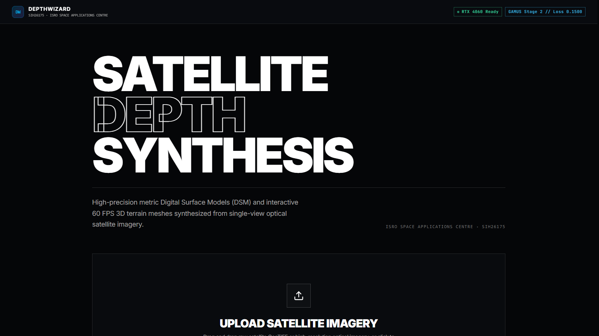
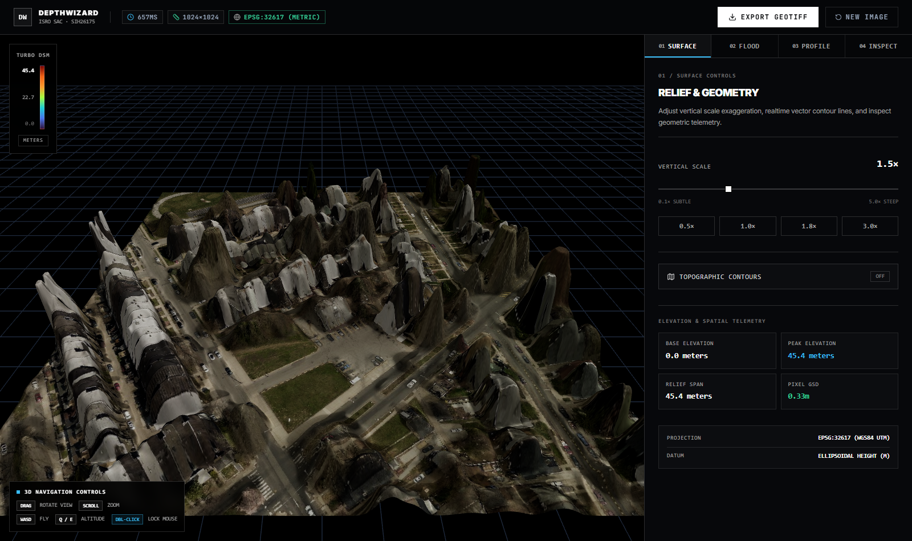
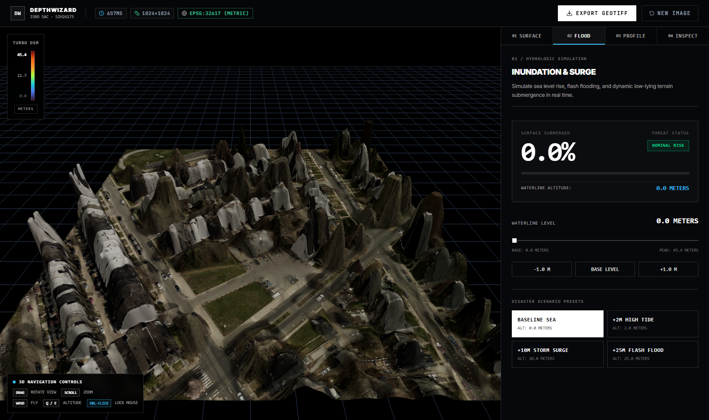
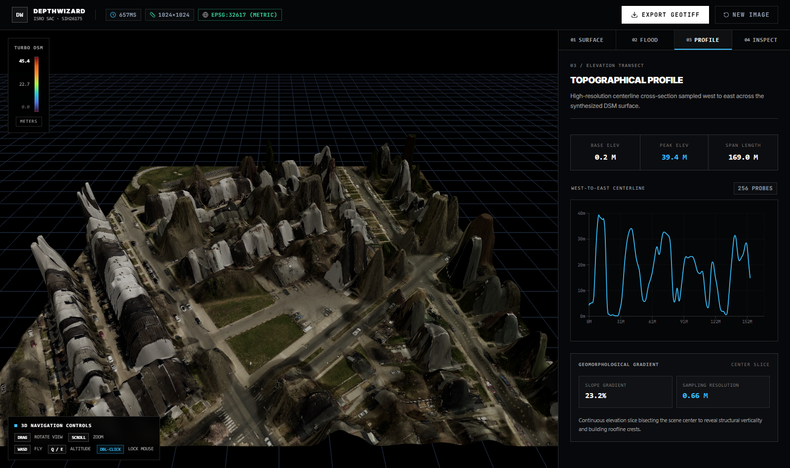
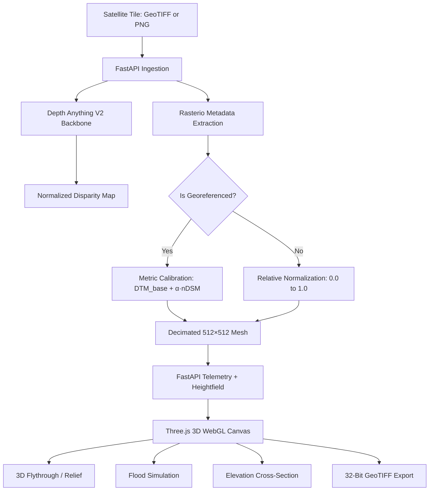

# DepthWizard — Single-View Satellite RGB to Metric DSM

[](https://www.python.org/downloads/)
[](https://pytorch.org/)
[](https://fastapi.tiangolo.com/)
[](https://react.dev/)
[](https://threejs.org/)
[](LICENSE)

**DepthWizard** reconstructs a high-fidelity **Digital Surface Model (DSM)** from a **single overhead satellite or aerial RGB image** — no stereo pairs or LiDAR required. It fine-tunes a `Depth Anything V2 ViT-S` backbone on the GAMUS/DFC2019 overhead dataset, calibrates predicted depth into metric elevation, and renders an interactive 3D WebGL terrain with flood simulation, cross-section profiling, and 32-bit GeoTIFF export.



---

## Highlights

| Feature | Description |
|---|---|
| **Single-view monocular DSM** | Fine-tuned `Depth Anything V2 ViT-S` using SILog + edge-gradient-matching losses (no stereo/LiDAR dependency). |
| **Metric prior calibration** | Georeferenced GeoTIFFs (`EPSG:32617`, `EPSG:32643`, sub-meter GSD) yield physical elevations in meters via morphological DTM/nDSM decomposition. |
| **Optical RGB support** | Standard PNG/JPG aerial imagery produces a normalized relative DSM in `[0.0, 1.0]`. |
| **Interactive 3D viewport** | Three.js WebGL canvas with displacement shading, 6-DoF flythrough, and elevation colormaps. |
| **Hydrologic flood simulator** | Real-time waterline thresholding with disaster presets (+2m high tide, +10m storm surge, +25m flash flood). |
| **Cross-section profiler** | 256-probe centerline elevation transect with geometric analytics. |
| **32-bit OGC GeoTIFF export** | Single-band `float32` raster preserving original CRS, affine transform, and GSD. |

---

## Demo Imagery

| Terrain view | Flood simulation | Cross-section |
|---|---|---|
|  |  |  |

---

## Architecture



- **Model**: `Depth-Anything-V2-Small-hf` (24.8M parameters), fine-tuned on `earthflow/GAMUS` (DFC2019).
- **Loss**: `ℒ = ℒ_SILog(d, d*) + λ·ℒ_Grad(d, d*)` — scale-invariant consistency plus Sobel edge sharpening.
- **Weights**: `backend/weights/best_model.pth` and `backend/weights/final_model.pth`, tracked via [Git LFS](https://git-lfs.com/).

---

## Documentation

| Area | Document |
|---|---|
| System brief | [docs/reports/system_brief_and_consultant_dossier.md](docs/reports/system_brief_and_consultant_dossier.md) |
| Project brief | [docs/reports/project_brief.md](docs/reports/project_brief.md) |
| Mesh architecture | [docs/reports/mesh_construction_and_project_architecture.md](docs/reports/mesh_construction_and_project_architecture.md) |
| Architecture master plan | [docs/architecture/DEPTHWIZARD_MASTER_PLAN.md](docs/architecture/DEPTHWIZARD_MASTER_PLAN.md) |
| Methodology | [docs/methodology/GAMUS_TRAINING_PLAN.md](docs/methodology/GAMUS_TRAINING_PLAN.md) · [docs/methodology/ISRO_SAC_RESEARCH_SPECIFICATION.md](docs/methodology/ISRO_SAC_RESEARCH_SPECIFICATION.md) |
| Benchmarks & verification | [docs/benchmarks/verification_report.md](docs/benchmarks/verification_report.md) · [docs/benchmarks/VALIDATION_BENCHMARK_REPORT.md](docs/benchmarks/VALIDATION_BENCHMARK_REPORT.md) |
| Training reports | [docs/training/README.md](docs/training/README.md) |
| Knowledge graph | [docs/knowledge-graph/GRAPH_REPORT.md](docs/knowledge-graph/GRAPH_REPORT.md) |

---

## Requirements

- **OS**: Windows 10/11, Linux, macOS.
- **Python**: 3.10–3.11 recommended.
- **Node.js**: 18.x or 20.x LTS.
- **GPU (recommended)**: NVIDIA with CUDA (e.g. RTX 3060/4060+); inference ~250–650 ms on CUDA `fp16`.
- **CPU (fallback)**: fully supported — PyTorch auto-selects CPU when CUDA is unavailable.

---

## Quickstart

### 1. Clone & fetch LFS weights
```bash
git clone https://github.com/tanishqkr/satellite-image-to-3d-terrain.git
cd satellite-image-to-3d-terrain
git lfs install
git lfs pull
```

### 2. Backend
```bash
python -m venv .venv
# Windows: .venv\Scripts\activate
# Linux/macOS: source .venv/bin/activate
pip install -r requirements.txt
```

### 3. Frontend
```bash
cd frontend
npm install
cd ..
```

### 4. Launch
**Terminal 1 — Backend API:**
```bash
# From project root:
.venv/bin/python backend/run_server.py   # Windows: .venv\Scripts\python.exe backend\run_server.py
# → http://127.0.0.1:8000
```

**Terminal 2 — Frontend dev server:**
```bash
cd frontend
npm run dev
# → http://localhost:5173
```

On Windows, `run_local.bat` launches both.

---

## Project Structure

```
├── backend/
│   ├── app/
│   │   ├── api/           # FastAPI routes + Pydantic schemas
│   │   ├── core/          # Config, paths, CORS
│   │   └── services/      # depth_estimator, calibration, mesh_builder, exporter, ...
│   ├── training/          # Losses, GAMUS fine-tuning, validation, benchmarks
│   ├── tests/             # Backend test suite
│   ├── weights/           # best_model.pth / final_model.pth (Git LFS)
│   ├── requirements.txt
│   └── run_server.py
├── frontend/
│   ├── src/
│   │   ├── components/    # TerrainCanvas, FloodSimulator, CrossSection, Dropzone, ...
│   │   ├── lib/           # voxelize, rayMarch, matrixCompositor, viewshed, hydrology utilities
│   │   ├── hooks/
│   │   ├── styles/
│   │   └── App.tsx
│   ├── public/            # Sample georeferenced + optical satellite tiles
│   └── package.json
├── docs/                  # Architecture, methodology, benchmarks, reports, training
├── scripts/               # Tooling: sample scene generator, browser E2E tests
├── test_datasets/         # GeoTIFF + optical verification tiles
├── requirements.txt
└── run_local.bat
```

---

## Testing

**Backend:**
```bash
cd backend
python -m pytest tests/
```

**Frontend:**
```bash
cd frontend
npm test
npm run build
```

See [docs/training/README.md](docs/training/README.md) for the model fine-tuning and validation details.

---

## License

[MIT](LICENSE)