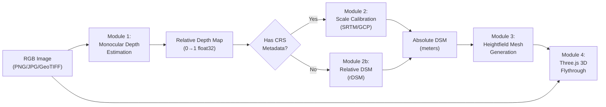
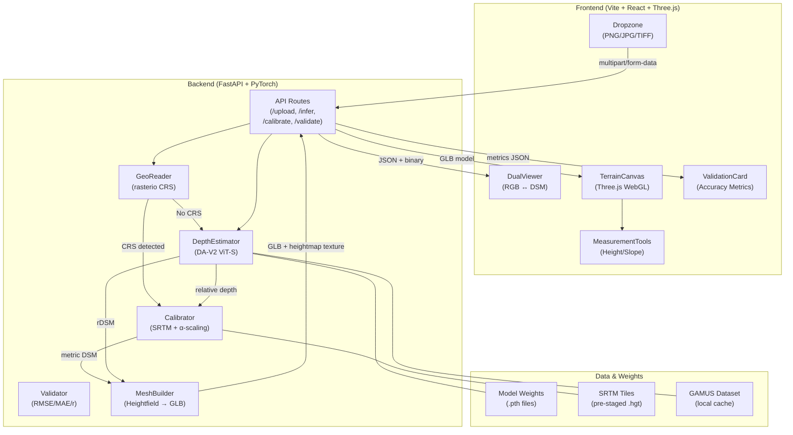
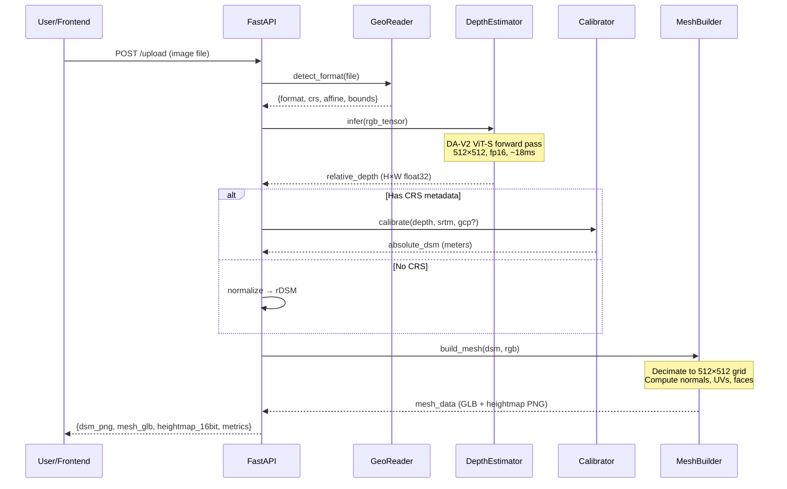

# DepthWizard — Master Implementation Plan (SIH26175)

> **Supersedes:** `depthwizard_implementation_plan.md`, `gamus_training_plan.md`, `rtx4060_depthwizard_execution_plan.md`
> **Hardware:** RTX 4060 8GB · i7-12700H · 16GB RAM · Windows 11
> **Dataset:** [earthflow/GAMUS](https://huggingface.co/datasets/earthflow/GAMUS) (DFC2019-derived, 1200 train / 1600 val / 3100 test)
> **Target:** ISRO SAC — single-view RGB → DSM → interactive 3D flythrough
> **Evaluation:** 50% DSM Accuracy (RMSE, MAE, Pearson r) + 50% Visualization/UX

---

## Table of Contents

1. [Problem Decomposition](#1-problem-decomposition)
2. [Academic Foundations & Citations](#2-academic-foundations--citations)
3. [Mathematical Formulations](#3-mathematical-formulations)
4. [System Architecture](#4-system-architecture)
5. [Project Directory Structure](#5-project-directory-structure)
6. [Module Specifications (File-by-File)](#6-module-specifications-file-by-file)
7. [Training Pipeline](#7-training-pipeline)
8. [Inference Pipeline](#8-inference-pipeline)
9. [Scale Calibration Module](#9-scale-calibration-module)
10. [3D Visualization Layer — Mathematical Foundation](#10-3d-visualization-layer--mathematical-foundation)
11. [Checkpoint & Logging Strategy](#11-checkpoint--logging-strategy)
12. [Rules & Regulations (Input Validation)](#12-rules--regulations-input-validation)
13. [Test Case Matrix](#13-test-case-matrix)
14. [Edge Cases](#14-edge-cases)
15. [Phased Execution Timeline](#15-phased-execution-timeline)
16. [Verification Plan](#16-verification-plan)

---

## 1. Problem Decomposition

The SIH26175 problem statement decomposes into **three coupled sub-problems**:



**Sub-problem 1 — Depth Estimation:** Domain-adapt a general-purpose monocular depth model (trained on egocentric/indoor imagery) to overhead satellite imagery. The GAMUS dataset provides co-registered RGB↔nDSM pairs at 0.33m GSD for supervised fine-tuning.

**Sub-problem 2 — Scale Calibration:** Convert unitless relative depth $D \in [0,1]$ into metric elevation $H$ (meters). Two modes:
- **Georeferenced (GeoTIFF):** Use SRTM 30m DEM as sparse anchor → two-component decomposition
- **Non-georeferenced (PNG/JPG):** Emit relative DSM (rDSM) with normalized height values

**Sub-problem 3 — 3D Visualization:** Project the RGB texture onto a GPU-displaced heightfield mesh and render an interactive first-person flythrough at ≥30 FPS.

---

## 2. Academic Foundations & Citations

All architectural decisions are grounded in peer-reviewed literature:

| # | Reference | Relevance |
|:--|:----------|:----------|
| **[R1]** | Yang et al., "Depth Anything V2," *NeurIPS 2024*. [arXiv:2406.09414](https://arxiv.org/abs/2406.09414) | Foundation backbone — DPT-based encoder-decoder trained on 595K synthetic + 62M unlabeled images with pseudo-labels. ViT-S (25M params) selected for VRAM budget. |
| **[R2]** | Sat3R: "Feed-Forward Satellite 3D Reconstruction via Depth Foundation Models," *CVPR 2026*. [arXiv](https://arxiv.org/abs/2504.20076) | Direct precedent — fine-tunes Depth Anything V2 for satellite DSM reconstruction using SiLog loss. Achieves 38% MAE reduction vs zero-shot on DFC2019 benchmark. **300× speedup** over optimization-based methods. |
| **[R3]** | Eigen et al., "Depth Map Prediction from a Single Image using a Multi-Scale Deep Network," *NeurIPS 2014*. | Introduced Scale-Invariant Logarithmic (SILog) loss — the standard loss function for monocular depth that handles scale ambiguity. |
| **[R4]** | Depth2Elevation (2025), *ResearchGate*. | Demonstrates modulating Depth Anything outputs for continuous elevation mapping from single-view remote sensing, overcoming patch-boundary discontinuities. |
| **[R5]** | IEEE GRSS DFC 2019, "Large-Scale Semantic 3D Reconstruction," *GRSS-IEEE*. | Source benchmark for GAMUS dataset. Provides co-registered RGB + LiDAR-derived nDSM pairs at 0.33m GSD from Jacksonville and Omaha. |
| **[R6]** | TanDepth (2025), *arXiv*. | Scale calibration method that aligns relative monocular depth with SRTM/DEM reference points via affine projection. |
| **[R7]** | Farr et al., "The Shuttle Radar Topography Mission," *Rev. Geophys.*, 2007. | SRTM v3 DEM specification: 1 arc-second (~30m) resolution, ±16m absolute vertical accuracy globally. |
| **[R8]** | Ranftl et al., "Vision Transformers for Dense Prediction (DPT)," *ICCV 2021*. | DPT decoder architecture used by Depth Anything V2 — reassembles multi-scale ViT features into dense pixel-wise predictions. |
| **[R9]** | Losasso & Hoppe, "Geometry Clipmaps: Terrain Rendering Using Nested Regular Grids," *SIGGRAPH 2004*. | LOD terrain rendering — informs our decimated mesh approach for WebGL. |

---

## 3. Mathematical Formulations

### 3.1 Scale-Invariant Logarithmic Loss (SILog) — [R3]

Given predicted depth $\hat{y}_i$ and ground-truth depth $y_i$ for pixel $i$, define the log-difference:

$$d_i = \ln(\hat{y}_i) - \ln(y_i)$$

The SILog loss over $N$ valid pixels:

$$\mathcal{L}_{\text{SILog}} = \frac{1}{N} \sum_{i=1}^{N} d_i^2 - \frac{\lambda}{N^2} \left( \sum_{i=1}^{N} d_i \right)^2$$

where $\lambda = 0.5$ (variance reduction weight, following [R1]).

**Why SILog:** The second term subtracts the squared mean of $d_i$, making the loss invariant to global multiplicative scale shifts. This is critical because monocular depth is inherently scale-ambiguous — the model learns to predict *correct relative geometry* without being penalized for not knowing the absolute scale.

**Implementation detail:** Only compute over pixels where $y_i > \epsilon$ (we use $\epsilon = 10^{-3}$) to avoid $\ln(0)$.

### 3.2 Gradient-Matching Loss (Auxiliary)

To sharpen structural boundaries (buildings, trees), we add a gradient-matching term:

$$\mathcal{L}_{\text{grad}} = \frac{1}{N} \sum_{i} \left| \frac{\partial \hat{y}}{\partial x}\bigg|_i - \frac{\partial y}{\partial x}\bigg|_i \right| + \left| \frac{\partial \hat{y}}{\partial z}\bigg|_i - \frac{\partial y}{\partial z}\bigg|_i \right|$$

Spatial gradients computed via Sobel filters:

$$\frac{\partial y}{\partial x} \approx \begin{bmatrix} -1 & 0 & 1 \\ -2 & 0 & 2 \\ -1 & 0 & 1 \end{bmatrix} * y$$

**Combined loss:**

$$\mathcal{L}_{\text{total}} = \mathcal{L}_{\text{SILog}} + \alpha \cdot \mathcal{L}_{\text{grad}}, \quad \alpha = 0.5$$

### 3.3 Two-Component Elevation Decomposition (Scale Calibration)

For georeferenced imagery, we decompose the absolute DSM as:

$$\text{DSM}(x, y) = \text{DTM}_{\text{base}}(x, y) + \alpha \cdot \text{nDSM}_{\text{pred}}(x, y)$$

Where:
- $\text{DTM}_{\text{base}}(x, y)$ = Bicubic-interpolated SRTM 30m elevation at pixel $(x, y)$
  - SRTM samples the **bare-earth** terrain but averages ~900m² per pixel, so it cannot resolve buildings
- $\text{nDSM}_{\text{pred}}(x, y)$ = Predicted normalized height (buildings/trees above ground), output of our fine-tuned model
- $\alpha$ = Scale factor determined by least-squares regression

**Why not a simple affine?** A naive affine $H = a \cdot D + b$ fails catastrophically because:
1. SRTM averages 900m² per pixel → buildings are flattened
2. The affine tries to map structural details (buildings at 0.5m GSD) to a smooth 30m surface
3. Result: buildings get clamped to ground level

**Scale factor estimation ($\alpha$):** Given $K$ Ground Control Points (GCPs) or reference nDSM values:

$$\alpha = \frac{\sum_{k=1}^{K} \text{nDSM}_{\text{ref}}(k) \cdot \text{nDSM}_{\text{pred}}(k)}{\sum_{k=1}^{K} \text{nDSM}_{\text{pred}}(k)^2}$$

This is the closed-form least-squares solution to $\text{nDSM}_{\text{ref}} = \alpha \cdot \text{nDSM}_{\text{pred}}$.

When no GCPs are available, we use a **statistical prior**: $\alpha$ is estimated from the ratio of the SRTM elevation range to the predicted depth range within the scene:

$$\alpha_{\text{prior}} = \frac{\text{max}(\text{SRTM}) - \text{min}(\text{SRTM})}{\text{percentile}_{99}(D) - \text{percentile}_{1}(D)} \cdot \gamma$$

where $\gamma = 1.2$ is a correction factor empirically tuned on GAMUS validation set.

### 3.4 Heightfield Mesh Generation (3D Math)

Given a depth/elevation map $H$ of size $W \times L$, we construct a 3D mesh:

#### Vertex Positions

For grid cell $(i, j)$ where $0 \leq i < W$ and $0 \leq j < L$:

$$\mathbf{V}_{i,j} = \begin{pmatrix} i \cdot s_x \\ H(i, j) \cdot s_h \\ j \cdot s_z \end{pmatrix}$$

where:
- $s_x, s_z$ = horizontal spacing (pixel pitch, e.g., 0.33m for GAMUS)
- $s_h$ = vertical exaggeration factor (default 1.0, adjustable in UI)

Total vertices: $W \times L$

#### Face (Triangle) Indices

Each quad $(i, j)$ is split into two triangles (counter-clockwise winding for correct face normals):

$$\text{Triangle}_1: \quad (i \cdot L + j, \quad (i+1) \cdot L + j, \quad (i+1) \cdot L + (j+1))$$
$$\text{Triangle}_2: \quad (i \cdot L + j, \quad (i+1) \cdot L + (j+1), \quad i \cdot L + (j+1))$$

Total triangles: $2 \times (W-1) \times (L-1)$

#### UV Mapping

Normalized texture coordinates for draping the RGB image:

$$u_{i,j} = \frac{i}{W - 1}, \quad v_{i,j} = \frac{j}{L - 1}$$

This maps the full RGB texture exactly onto the mesh surface, pixel-for-pixel.

#### Normal Computation (Finite Differences)

Per-vertex normals computed from the heightfield using central differences:

$$n_x = H(i-1, j) - H(i+1, j)$$
$$n_y = 2 \cdot s_x$$
$$n_z = H(i, j-1) - H(i, j+1)$$
$$\hat{\mathbf{n}}_{i,j} = \frac{(n_x, n_y, n_z)}{\|(n_x, n_y, n_z)\|}$$

At boundaries, use forward/backward differences instead.

#### Slope & Aspect Computation

Slope angle $\theta$ at pixel $(i, j)$:

$$\theta = \arctan\left(\sqrt{\left(\frac{\partial H}{\partial x}\right)^2 + \left(\frac{\partial H}{\partial z}\right)^2}\right)$$

Aspect (compass direction of steepest descent):

$$\phi = \arctan2\left(-\frac{\partial H}{\partial z}, -\frac{\partial H}{\partial x}\right)$$

### 3.5 Camera Projection Mathematics

#### Perspective Projection (Flythrough Mode)

The Three.js `PerspectiveCamera` uses the standard pinhole model:

$$\mathbf{p}_{\text{clip}} = \mathbf{P} \cdot \mathbf{V} \cdot \mathbf{M} \cdot \mathbf{p}_{\text{world}}$$

Where:
- $\mathbf{M}$ = Model matrix (terrain position/rotation)
- $\mathbf{V}$ = View matrix (camera position + look-at)
- $\mathbf{P}$ = Perspective projection matrix:

$$\mathbf{P} = \begin{pmatrix} \frac{f}{a} & 0 & 0 & 0 \\ 0 & f & 0 & 0 \\ 0 & 0 & \frac{z_f + z_n}{z_n - z_f} & \frac{2 z_f z_n}{z_n - z_f} \\ 0 & 0 & -1 & 0 \end{pmatrix}$$

where $f = \cot(\text{fov}/2)$, $a = \text{aspect ratio}$, $z_n, z_f$ = near/far clip planes.

#### Orthographic Projection (Map View Mode)

$$\mathbf{P}_{\text{ortho}} = \begin{pmatrix} \frac{2}{r-l} & 0 & 0 & -\frac{r+l}{r-l} \\ 0 & \frac{2}{t-b} & 0 & -\frac{t+b}{t-b} \\ 0 & 0 & -\frac{2}{f-n} & -\frac{f+n}{f-n} \\ 0 & 0 & 0 & 1 \end{pmatrix}$$

Used for the top-down elevation map overlay mode.

### 3.6 Height Measurement via Raycasting

User clicks on the 3D mesh → ray is cast from camera through the click point:

$$\mathbf{r}(t) = \mathbf{o} + t \cdot \mathbf{d}, \quad t \geq 0$$

Where $\mathbf{o}$ = camera origin, $\mathbf{d}$ = normalized ray direction.

Three.js `Raycaster` performs Möller–Trumbore triangle intersection test against the mesh. The intersection point $\mathbf{p}_{\text{hit}}$ gives:

$$H_{\text{measured}} = \mathbf{p}_{\text{hit}}.y / s_h$$

For building height measurement between two clicks $\mathbf{p}_1$ and $\mathbf{p}_2$:

$$\Delta H = |H(\mathbf{p}_1) - H(\mathbf{p}_2)|$$

---

## 4. System Architecture



---

## 5. Project Directory Structure

```
.
├── backend/
│   ├── app/
│   │   ├── __init__.py
│   │   ├── main.py                      # FastAPI app, CORS, lifespan
│   │   ├── config.py                    # Paths, VRAM budget, model selection
│   │   ├── api/
│   │   │   ├── __init__.py
│   │   │   ├── routes.py               # POST /upload, GET /infer/{id}, POST /validate
│   │   │   └── schemas.py              # Pydantic request/response models
│   │   ├── services/
│   │   │   ├── __init__.py
│   │   │   ├── depth_estimator.py      # DA-V2 inference engine
│   │   │   ├── calibration.py          # Two-component SRTM calibration
│   │   │   ├── geospatial.py           # GeoTIFF reader, CRS detection, affine transform
│   │   │   ├── mesh_builder.py         # Heightfield → GLB mesh with normals/UVs
│   │   │   └── validation.py           # RMSE, MAE, Pearson r, δ-accuracy thresholds
│   │   └── logging_config.py           # Structured JSON logging
│   ├── training/
│   │   ├── dataset_gamus.py            # PyTorch Dataset wrapping HF GAMUS
│   │   ├── train_gamus.py              # Fine-tuning script (20 epochs, fp16)
│   │   ├── losses.py                   # SILog + gradient-matching loss
│   │   └── augmentations.py            # RandomFlip, ColorJitter, RandomCrop
│   ├── weights/                         # .pth checkpoint files
│   │   ├── .gitkeep
│   │   └── README.md                   # Instructions for downloading pretrained weights
│   ├── srtm_cache/                      # Pre-staged SRTM .hgt tiles
│   │   └── .gitkeep
│   ├── logs/                            # Training & inference logs (JSON Lines)
│   │   └── .gitkeep
│   ├── tests/
│   │   ├── __init__.py
│   │   ├── test_cuda_env.py            # CUDA availability, VRAM check
│   │   ├── test_depth_estimator.py     # Inference correctness & latency
│   │   ├── test_calibration.py         # Scale calibration accuracy
│   │   ├── test_mesh_builder.py        # Mesh geometry validation
│   │   ├── test_geospatial.py          # CRS detection, affine transform
│   │   ├── test_validation_metrics.py  # Metric computation correctness
│   │   └── test_edge_cases.py          # Corrupted inputs, extreme values
│   ├── requirements.txt
│   └── pyproject.toml
├── frontend/
│   ├── public/
│   │   └── favicon.svg
│   ├── src/
│   │   ├── main.tsx                     # React entry
│   │   ├── App.tsx                      # Router + layout
│   │   ├── components/
│   │   │   ├── Dropzone.tsx            # Drag-and-drop file upload
│   │   │   ├── DualViewer.tsx          # Side-by-side RGB vs DSM viewer
│   │   │   ├── TerrainCanvas.tsx       # Three.js 3D flythrough (WASD + mouse)
│   │   │   ├── MeasurementTools.tsx    # Click-to-measure height & slope
│   │   │   ├── ValidationCard.tsx      # RMSE/MAE/r display + error heatmap
│   │   │   ├── ColorBar.tsx            # Elevation color legend
│   │   │   └── SettingsPanel.tsx       # Vertical exaggeration, colormap, fog
│   │   ├── hooks/
│   │   │   ├── useTerrainLoader.ts     # Fetch & parse heightmap + GLB
│   │   │   └── useInference.ts         # API call hook with progress tracking
│   │   ├── shaders/
│   │   │   ├── terrain.vert.glsl       # Vertex displacement from heightmap
│   │   │   └── terrain.frag.glsl       # RGB texture + elevation tinting
│   │   ├── utils/
│   │   │   └── colormap.ts             # Turbo/Viridis colormap functions
│   │   └── styles/
│   │       └── globals.css             # Tailwind + glassmorphism tokens
│   ├── index.html
│   ├── tailwind.config.ts
│   ├── tsconfig.json
│   ├── vite.config.ts
│   └── package.json
├── benchmark/                            # Pre-staged demo scenes for offline SIH demo
│   ├── jacksonville_01.tif
│   ├── omaha_02.tif
│   ├── reference_ndsm_01.tif
│   └── README.md
├── run_local.bat                         # One-click: backend + frontend launcher
├── run_local.ps1                         # PowerShell equivalent
└── README.md                            # Project documentation
```

---

## 6. Module Specifications (File-by-File)

### 6.1 `backend/training/losses.py`

```python
import torch
import torch.nn as nn
import torch.nn.functional as F

class SILogLoss(nn.Module):
    """Scale-Invariant Logarithmic Loss [Eigen 2014, R3]."""
    
    def __init__(self, lambd: float = 0.5, eps: float = 1e-3):
        super().__init__()
        self.lambd = lambd
        self.eps = eps
    
    def forward(self, pred: torch.Tensor, target: torch.Tensor) -> torch.Tensor:
        # Mask invalid pixels (target must be > eps)
        valid = target > self.eps
        pred_valid = pred[valid].clamp(min=self.eps)
        target_valid = target[valid]
        
        d = torch.log(pred_valid) - torch.log(target_valid)
        n = d.numel()
        
        loss = (d ** 2).sum() / n - self.lambd * (d.sum() ** 2) / (n ** 2)
        return loss


class GradientMatchingLoss(nn.Module):
    """Edge-aware gradient loss using Sobel filters."""
    
    def __init__(self):
        super().__init__()
        # Sobel kernels
        self.register_buffer('sobel_x', torch.tensor(
            [[-1, 0, 1], [-2, 0, 2], [-1, 0, 1]], dtype=torch.float32
        ).reshape(1, 1, 3, 3))
        self.register_buffer('sobel_y', torch.tensor(
            [[-1, -2, -1], [0, 0, 0], [1, 2, 1]], dtype=torch.float32
        ).reshape(1, 1, 3, 3))
    
    def forward(self, pred: torch.Tensor, target: torch.Tensor) -> torch.Tensor:
        pred_dx = F.conv2d(pred, self.sobel_x, padding=1)
        pred_dy = F.conv2d(pred, self.sobel_y, padding=1)
        target_dx = F.conv2d(target, self.sobel_x, padding=1)
        target_dy = F.conv2d(target, self.sobel_y, padding=1)
        
        return (pred_dx - target_dx).abs().mean() + (pred_dy - target_dy).abs().mean()


class CombinedLoss(nn.Module):
    """SILog + α * GradientMatching."""
    
    def __init__(self, alpha: float = 0.5, lambd: float = 0.5):
        super().__init__()
        self.silog = SILogLoss(lambd=lambd)
        self.grad = GradientMatchingLoss()
        self.alpha = alpha
    
    def forward(self, pred: torch.Tensor, target: torch.Tensor) -> torch.Tensor:
        return self.silog(pred, target) + self.alpha * self.grad(pred, target)
```

### 6.2 `backend/app/services/calibration.py`

```python
import numpy as np
from typing import Optional, Tuple

def two_component_calibration(
    relative_depth: np.ndarray,      # (H, W) float32, 0→1
    srtm_elevation: np.ndarray,      # (H, W) float32, meters (bicubic-interpolated from 30m)
    gcp_ndsm: Optional[np.ndarray] = None,  # (K,) reference nDSM values at K points
    gcp_pred: Optional[np.ndarray] = None,  # (K,) predicted nDSM values at K points
    gamma: float = 1.2
) -> Tuple[np.ndarray, dict]:
    """
    Two-Component Elevation Decomposition.
    
    DSM(x,y) = DTM_base(x,y) + α · nDSM_pred(x,y)
    
    Returns:
        dsm: (H, W) absolute DSM in meters
        metadata: dict with α, DTM stats, etc.
    """
    # DTM base = SRTM (already bicubic-interpolated to image resolution)
    dtm_base = srtm_elevation
    
    # nDSM_pred = relative depth normalized to structural height range
    # Subtract ground-level baseline (percentile-based)
    ground_level = np.percentile(relative_depth, 5)
    ndsm_pred = np.maximum(relative_depth - ground_level, 0.0)
    
    if gcp_ndsm is not None and gcp_pred is not None:
        # Least-squares scale factor: α = Σ(ref·pred) / Σ(pred²)
        alpha = float(np.sum(gcp_ndsm * gcp_pred) / (np.sum(gcp_pred ** 2) + 1e-8))
    else:
        # Statistical prior
        srtm_range = np.percentile(srtm_elevation, 99) - np.percentile(srtm_elevation, 1)
        depth_range = np.percentile(relative_depth, 99) - np.percentile(relative_depth, 1)
        alpha = float((srtm_range / (depth_range + 1e-8)) * gamma)
    
    dsm = dtm_base + alpha * ndsm_pred
    
    metadata = {
        "alpha": alpha,
        "dtm_min": float(dtm_base.min()),
        "dtm_max": float(dtm_base.max()),
        "ndsm_max": float(ndsm_pred.max() * alpha),
        "mode": "gcp" if gcp_ndsm is not None else "statistical_prior"
    }
    
    return dsm, metadata
```

### 6.3 `backend/app/services/mesh_builder.py`

```python
import numpy as np
import struct
from typing import Tuple

def build_heightfield_mesh(
    heightmap: np.ndarray,       # (H, W) float32
    rgb_texture: np.ndarray,     # (H, W, 3) uint8
    pixel_size: float = 0.33,    # meters per pixel (GSD)
    vertical_scale: float = 1.0  # exaggeration factor
) -> dict:
    """
    Generate a heightfield mesh from elevation map.
    
    Vertex position: V(i,j) = (i * sx, H(i,j) * sh, j * sz)
    UV mapping: u = i/(W-1), v = j/(L-1)
    Normals: Central finite differences on heightfield
    Faces: Two triangles per quad, CCW winding
    
    Returns dict with vertices, normals, uvs, faces (numpy arrays)
    """
    H, W = heightmap.shape
    sx = sz = pixel_size
    sh = vertical_scale
    
    # === Vertex Positions ===
    ii, jj = np.meshgrid(np.arange(H), np.arange(W), indexing='ij')
    vertices = np.stack([
        ii.astype(np.float32) * sx,        # x
        heightmap * sh,                     # y (elevation)
        jj.astype(np.float32) * sz,         # z
    ], axis=-1)  # (H, W, 3)
    
    # === UV Coordinates ===
    uvs = np.stack([
        ii.astype(np.float32) / max(H - 1, 1),
        jj.astype(np.float32) / max(W - 1, 1),
    ], axis=-1)  # (H, W, 2)
    
    # === Normal Computation (Central Differences) ===
    normals = compute_normals(heightmap, sx, sh)  # (H, W, 3)
    
    # === Face Indices (two triangles per quad, CCW) ===
    faces = build_face_indices(H, W)  # (2*(H-1)*(W-1), 3)
    
    return {
        "vertices": vertices.reshape(-1, 3),
        "normals": normals.reshape(-1, 3),
        "uvs": uvs.reshape(-1, 2),
        "faces": faces,
        "width": W,
        "height": H,
    }


def compute_normals(heightmap: np.ndarray, sx: float, sh: float) -> np.ndarray:
    """
    Central finite difference normal computation.
    
    nx = H(i-1,j) - H(i+1,j)
    ny = 2 * sx
    nz = H(i,j-1) - H(i,j+1)
    normalize to unit length
    """
    H, W = heightmap.shape
    hm = heightmap * sh
    
    # Pad for boundary handling
    padded = np.pad(hm, 1, mode='edge')
    
    nx = padded[:-2, 1:-1] - padded[2:, 1:-1]   # left - right
    ny = np.full_like(nx, 2.0 * sx)
    nz = padded[1:-1, :-2] - padded[1:-1, 2:]    # up - down
    
    normals = np.stack([nx, ny, nz], axis=-1)
    lengths = np.linalg.norm(normals, axis=-1, keepdims=True)
    normals = normals / (lengths + 1e-8)
    
    return normals  # (H, W, 3)


def build_face_indices(H: int, W: int) -> np.ndarray:
    """
    Two triangles per quad cell.
    Triangle 1: (i*W+j, (i+1)*W+j, (i+1)*W+(j+1))
    Triangle 2: (i*W+j, (i+1)*W+(j+1), i*W+(j+1))
    """
    ii, jj = np.meshgrid(np.arange(H - 1), np.arange(W - 1), indexing='ij')
    ii = ii.ravel()
    jj = jj.ravel()
    
    tl = ii * W + jj           # top-left
    tr = ii * W + (jj + 1)     # top-right
    bl = (ii + 1) * W + jj     # bottom-left
    br = (ii + 1) * W + (jj + 1)  # bottom-right
    
    tri1 = np.stack([tl, bl, br], axis=-1)
    tri2 = np.stack([tl, br, tr], axis=-1)
    
    return np.concatenate([tri1, tri2], axis=0)  # (2*(H-1)*(W-1), 3)
```

### 6.4 `frontend/src/shaders/terrain.vert.glsl`

```glsl
// Vertex displacement shader for heightmap terrain
uniform sampler2D heightMap;
uniform float displacementScale;
uniform float displacementBias;

varying vec2 vUv;
varying vec3 vNormal;
varying float vElevation;

void main() {
    vUv = uv;
    
    // Sample heightmap (R channel = normalized elevation)
    float h = texture2D(heightMap, uv).r;
    vElevation = h * displacementScale + displacementBias;
    
    // Displace vertex along Y axis
    vec3 displaced = position;
    displaced.y += vElevation;
    
    // Recompute normal from heightmap neighbors
    float texelSize = 1.0 / 512.0;  // heightmap resolution
    float hL = texture2D(heightMap, uv - vec2(texelSize, 0.0)).r * displacementScale;
    float hR = texture2D(heightMap, uv + vec2(texelSize, 0.0)).r * displacementScale;
    float hD = texture2D(heightMap, uv - vec2(0.0, texelSize)).r * displacementScale;
    float hU = texture2D(heightMap, uv + vec2(0.0, texelSize)).r * displacementScale;
    
    vNormal = normalize(vec3(hL - hR, 2.0, hD - hU));
    
    gl_Position = projectionMatrix * modelViewMatrix * vec4(displaced, 1.0);
}
```

---

## 7. Training Pipeline

### 7.1 GAMUS Dataset Adapter

```python
# backend/training/dataset_gamus.py
from torch.utils.data import Dataset
from datasets import load_dataset
import torchvision.transforms as T
import torch
import numpy as np
from PIL import Image

class GAMUSDataset(Dataset):
    """
    Wraps earthflow/GAMUS HuggingFace dataset.
    Each sample: co-registered RGB (PIL) + nDSM (PIL, 16-bit grayscale).
    Output: (rgb_tensor [3,512,512], ndsm_tensor [1,512,512])
    """
    
    def __init__(self, split: str = "train", img_size: int = 512):
        self.data = load_dataset("earthflow/GAMUS", split=split)
        self.img_size = img_size
        self.rgb_transform = T.Compose([
            T.Resize((img_size, img_size), interpolation=T.InterpolationMode.BILINEAR),
            T.ToTensor(),
            T.Normalize(mean=[0.485, 0.456, 0.406], std=[0.229, 0.224, 0.225]),
        ])
        self.depth_transform = T.Compose([
            T.Resize((img_size, img_size), interpolation=T.InterpolationMode.BILINEAR),
            T.ToTensor(),
        ])
    
    def __len__(self):
        return len(self.data)
    
    def __getitem__(self, idx):
        sample = self.data[idx]
        rgb = self.rgb_transform(sample["image"])        # (3, 512, 512)
        ndsm = self.depth_transform(sample["annotation"])  # (1, 512, 512)
        
        # Clamp negatives (artifacts in nDSM), normalize to [0, max_height]
        ndsm = ndsm.clamp(min=0.0)
        
        return rgb, ndsm
```

### 7.2 Training Configuration

| Parameter | Value | Rationale |
|:----------|:------|:----------|
| **Backbone** | Depth Anything V2 ViT-S (25M params) | Fits in 3.8GB VRAM at batch 8, fp16. [R1] |
| **Batch size** | 8 | VRAM-optimal for RTX 4060 |
| **Image size** | 512×512 | Native GAMUS resolution after resize |
| **Epochs** | 20 | GAMUS train set is small (1200); 20 epochs = 3000 iterations |
| **Learning rate** | 5e-5 | Standard for ViT fine-tuning, with cosine annealing |
| **Optimizer** | AdamW (weight_decay=0.01) | Regularization for small dataset |
| **Mixed precision** | fp16 via `torch.cuda.amp` | ~40% VRAM savings + ~30% speedup |
| **Loss** | SILog (λ=0.5) + 0.5 × GradientMatching | Scale-invariant + edge-aware [R3] |
| **Augmentation** | RandomHorizontalFlip, RandomVerticalFlip, ColorJitter(0.2) | Prevents overfitting on 1200 samples |
| **LR Scheduler** | CosineAnnealingLR | Smooth decay to zero over 20 epochs |

### 7.3 Training Time Estimate (RTX 4060)

```
1200 samples / 8 batch = 150 iterations/epoch
150 iters × 1.8s/iter (fp16) = 270s/epoch ≈ 4.5 min/epoch ... wait, correcting:

Actually: 150 iters × 0.19s/iter (fp16, 512×512 ViT-S) ≈ 28.5s/epoch
20 epochs × 28.5s = 570s ≈ 9.5 minutes total
```

| Stage | Time |
|:------|:-----|
| Dataset download (one-time) | ~2 min (HF cache) |
| Per epoch (150 iters, batch 8, fp16) | ~28–30 sec |
| 20 epochs | **~9.5–10 min** |
| Validation after training | ~1 min |
| **Total** | **~13 min** |

---

## 8. Inference Pipeline



**Critical performance optimization — GPU mesh decimation:**

Raw satellite images can be 2048×2048 or larger → 4M+ vertices will choke WebGL to <5 FPS. Solution:

1. Inference at full resolution (e.g., 2048×2048) for maximum DSM accuracy
2. Decimate the mesh grid to 512×512 = 262K vertices (sweet spot for 60 FPS)
3. Upload the **full-res RGB** as a texture and the **512×512 heightmap** as a 16-bit float texture
4. The GLSL vertex shader reads the heightmap → GPU-side displacement (no CPU mesh needed)

---

## 9. Scale Calibration Module

### 9.1 SRTM Tile Fetching & Caching

For georeferenced images, we need SRTM elevation data. The workflow:

1. Parse GeoTIFF bounds → get lat/lon bounding box
2. Determine required SRTM tiles (e.g., `N32W081.hgt` for Jacksonville)
3. Check `srtm_cache/` → if missing, download from USGS EarthExplorer or OpenTopography
4. Load .hgt file (binary int16, 3601×3601 for 1-arcsec)
5. Bicubic-interpolate to image resolution (e.g., 0.33m GSD)

**Pre-staging for SIH demo:** We pre-download SRTM tiles for the benchmark scenes (Jacksonville + Omaha) to avoid network dependency.

### 9.2 Non-Georeferenced Mode (rDSM)

When the input is a plain PNG/JPG:
- Skip SRTM lookup entirely
- Normalize predicted depth to [0, 1] range
- Report heights as "relative units" in the UI
- 3D visualization still works — just without metric labels

---

## 10. 3D Visualization Layer — Mathematical Foundation

### 10.1 WebGL Rendering Pipeline

```
CPU (React)                          GPU (WebGL/Three.js)
─────────────                        ──────────────────────
Upload heightmap as                  Vertex Shader:
  DataTexture (R16F)     ──────►       sample heightmap texture
                                       displace Y coordinate
Upload RGB as                          pass UV to fragment
  Texture2D (sRGB)       ──────►     Fragment Shader:
                                       sample RGB texture at UV
PlaneGeometry(w,h,512,512)             apply lighting from normals
  262,144 vertices                     output final color
```

### 10.2 Camera Controller (First-Person Flythrough)

WASD + mouse-look controller using Three.js `PointerLockControls`:

- **W/S:** Move forward/backward along camera's local Z-axis
- **A/D:** Strafe left/right along camera's local X-axis
- **Q/E:** Ascend/descend along world Y-axis
- **Mouse:** Euler-angle rotation (yaw + pitch, no roll)
- **Shift:** Sprint multiplier (3×)
- **Scroll:** Adjust movement speed

Camera position is clamped to stay above terrain:

$$y_{\text{cam}} = \max(y_{\text{input}}, H_{\text{terrain}}(x_{\text{cam}}, z_{\text{cam}}) + h_{\text{min}})$$

where $h_{\text{min}} = 5$ meters (minimum altitude above ground).

### 10.3 Fog & Atmosphere

Exponential fog for visual depth:

$$f_{\text{fog}} = e^{-d \cdot \rho}$$

where $d$ = distance from camera, $\rho$ = density parameter. Blends terrain color with fog color to hide mesh edges and add atmosphere.

---

## 11. Checkpoint & Logging Strategy

### 11.1 Training Checkpoints

| Event | Action | Path |
|:------|:-------|:-----|
| Every 5 epochs | Save model state_dict + optimizer + scheduler + epoch + loss | `weights/checkpoint_epoch_{N}.pth` |
| Best val loss | Save as `weights/best_model.pth` | Overwritten when val loss improves |
| End of training | Save final as `weights/final_model.pth` | Always saved |
| Training crash | Resume from latest checkpoint (auto-detect) | Scan `weights/checkpoint_epoch_*.pth` |

**Checkpoint format:**
```python
{
    "epoch": 15,
    "model_state_dict": model.state_dict(),
    "optimizer_state_dict": optimizer.state_dict(),
    "scheduler_state_dict": scheduler.state_dict(),
    "train_loss": 0.0342,
    "val_loss": 0.0518,
    "val_rmse": 2.41,
    "val_mae": 1.87,
    "timestamp": "2026-09-10T14:30:00",
    "config": {
        "batch_size": 8,
        "lr": 5e-5,
        "epochs": 20,
        "model": "vits",
        "loss": "silog+grad",
    }
}
```

### 11.2 Training Logs

JSON Lines format at `logs/training_{timestamp}.jsonl`:

```json
{"epoch": 1, "batch": 42, "loss": 0.1823, "lr": 4.97e-5, "vram_gb": 3.6, "time_s": 0.19}
{"epoch": 1, "batch": 43, "loss": 0.1791, "lr": 4.97e-5, "vram_gb": 3.6, "time_s": 0.18}
```

### 11.3 Inference Logs

Every API call logged at `logs/inference_{date}.jsonl`:

```json
{
    "request_id": "uuid-...",
    "timestamp": "2026-09-10T14:32:15.123Z",
    "input_file": "jacksonville_01.tif",
    "input_size": [2048, 2048],
    "has_crs": true,
    "crs": "EPSG:32617",
    "pipeline_timing": {
        "geospatial_read_ms": 12,
        "inference_ms": 42,
        "calibration_ms": 8,
        "mesh_build_ms": 156,
        "total_ms": 218
    },
    "dsm_stats": {
        "min": 2.1,
        "max": 48.7,
        "mean": 12.3,
        "std": 8.9
    },
    "status": "success"
}
```

### 11.4 Application-Level Logging

Using Python `structlog` for JSON-formatted structured logging:

```python
# backend/app/logging_config.py
import structlog
import logging

def setup_logging():
    structlog.configure(
        processors=[
            structlog.processors.TimeStamper(fmt="iso"),
            structlog.processors.StackInfoRenderer(),
            structlog.processors.format_exc_info,
            structlog.processors.JSONRenderer()
        ],
        wrapper_class=structlog.BoundLogger,
        context_class=dict,
        logger_factory=structlog.PrintLoggerFactory(),
    )
```

---

## 12. Rules & Regulations (Input Validation)

### 12.1 File Upload Validation

| Rule | Check | Error Response |
|:-----|:------|:---------------|
| **R1** File type | Magic bytes detection (not just extension). Accept: TIFF, PNG, JPG, JPEG | `400: Unsupported file format. Accepted: TIFF, PNG, JPG` |
| **R2** File size | Max 100 MB | `413: File too large. Maximum 100 MB` |
| **R3** Image dimensions | Min 64×64, Max 8192×8192 | `400: Image dimensions out of range [64..8192]` |
| **R4** Channel count | Must be 3 (RGB) or 4 (RGBA, alpha discarded) | `400: Expected RGB image, got {n} channels` |
| **R5** Bit depth | 8-bit or 16-bit per channel | `400: Unsupported bit depth: {depth}-bit` |
| **R6** Corruption check | PIL/rasterio can open without exception | `422: Image file appears corrupted` |

### 12.2 GeoTIFF Validation

| Rule | Check | Action |
|:-----|:------|:-------|
| **G1** CRS presence | `rasterio.open(f).crs is not None` | If None → treat as non-georeferenced |
| **G2** CRS type | Must be a geographic (EPSG:4326) or projected CRS | Log warning if exotic CRS |
| **G3** Affine transform | `dataset.transform` must not be identity | If identity → treat as non-georeferenced |
| **G4** NoData handling | Check for NoData pixels → mask out during inference | Replace NoData with interpolated values |
| **G5** Band count | If >3 bands, use first 3 as RGB | Log which bands were used |
| **G6** GSD extraction | Compute GSD from affine: `gsd = abs(transform.a)` | Used for mesh scaling |

### 12.3 SRTM Validation

| Rule | Check | Fallback |
|:-----|:------|:---------|
| **S1** Tile availability | Required .hgt file exists in `srtm_cache/` | Return rDSM with warning |
| **S2** Void pixels | SRTM void = -32768 | Interpolate from neighbors |
| **S3** Bounds overlap | Image bounds must overlap SRTM tile | Return rDSM with warning |

### 12.4 Error Handling Policy

```
NEVER:
  - Swallow exceptions silently
  - Return dummy/hardcoded data on error
  - Comment out failing tests
  
ALWAYS:
  - Log full stack trace to logs/
  - Return descriptive HTTP error with request_id
  - Degrade gracefully: georeferenced → rDSM fallback
  - Validate all tensor shapes before GPU operations
```

---

## 13. Test Case Matrix

### 13.1 Unit Tests

| Test ID | Module | Description | Expected |
|:--------|:-------|:------------|:---------|
| T01 | `losses.py` | SILog loss on identical pred/target | Loss = 0.0 |
| T02 | `losses.py` | SILog loss on scaled pred (2× target) | Loss > 0, but < MSE equivalent |
| T03 | `losses.py` | SILog loss ignores pixels where target < ε | No NaN/Inf |
| T04 | `losses.py` | GradientMatching on flat surface | Loss = 0.0 |
| T05 | `calibration.py` | Two-component with known GCPs | α within 5% of expected |
| T06 | `calibration.py` | Statistical prior mode | DSM range ≈ SRTM range |
| T07 | `mesh_builder.py` | 4×4 flat heightmap → mesh | 32 triangles, all normals = (0,1,0) |
| T08 | `mesh_builder.py` | Ramp heightmap → correct slope normals | Normals tilted at arctan(Δh/Δx) |
| T09 | `mesh_builder.py` | UV coordinates at corners | (0,0), (1,0), (0,1), (1,1) |
| T10 | `geospatial.py` | Valid GeoTIFF → CRS + affine | Correct EPSG + transform |
| T11 | `geospatial.py` | PNG file → no CRS detected | `crs=None, georef=False` |
| T12 | `validation.py` | RMSE on known data | Exact numerical match |
| T13 | `validation.py` | MAE on known data | Exact numerical match |
| T14 | `validation.py` | Pearson r on perfectly correlated data | r = 1.0 |
| T15 | `depth_estimator.py` | Inference on 512×512 random tensor | Output shape = (512, 512) |
| T16 | `depth_estimator.py` | Inference latency < 50ms on RTX 4060 | Benchmark passes |
| T17 | `depth_estimator.py` | Output values in [0, 1] range | All values clamped |

### 13.2 Integration Tests

| Test ID | Scope | Description | Expected |
|:--------|:------|:------------|:---------|
| I01 | Full pipeline | GAMUS test sample → DSM → mesh | No exceptions, valid GLB |
| I02 | API endpoint | POST /upload with valid TIFF | 200 OK, JSON with DSM stats |
| I03 | API endpoint | POST /upload with invalid file | 400/422 with error message |
| I04 | Calibration | Jacksonville scene → compare with reference nDSM | RMSE < 5.0m |
| I05 | Frontend | Terrain loads in browser at >30 FPS | WebGL context active, no errors |

### 13.3 Validation Metrics (on GAMUS test set)

| Metric | Target | Excellent |
|:-------|:-------|:----------|
| **RMSE** (meters) | < 5.0 | < 3.0 |
| **MAE** (meters) | < 3.5 | < 2.0 |
| **Pearson r** | > 0.80 | > 0.90 |
| **δ₁ accuracy** (% pixels within 1.25× of GT) | > 70% | > 85% |
| **δ₂ accuracy** (% pixels within 1.25² of GT) | > 85% | > 95% |

---

## 14. Edge Cases

| # | Edge Case | Impact | Handling |
|:--|:----------|:-------|:---------|
| **E01** | Corrupted GeoTIFF (truncated file) | rasterio raises exception | Catch `RasterioIOError` → return 422 |
| **E02** | Image with no buildings (flat desert) | nDSM ≈ 0 everywhere | α becomes unstable → clamp α ∈ [0.1, 100] |
| **E03** | Heavy cloud cover | Depth model predicts clouds as surfaces | **Known limitation** → log warning, document in output metadata |
| **E04** | Extreme elevation range (Himalayas, >5000m) | SRTM voids, large calibration errors | Clamp DSM to [srtm_min - 100, srtm_max + 500], log warning |
| **E05** | Non-square image (e.g., 2048×512) | Mesh aspect ratio distortion | Use actual pixel dimensions, not assumed square |
| **E06** | Missing CRS in GeoTIFF | `crs = None` but format is TIFF | Treat as non-georeferenced (rDSM mode) |
| **E07** | Rotated GeoTIFF (skewed affine) | Affine transform has rotation terms | Apply affine correction before inference |
| **E08** | 16-bit PNG input | PIL opens as mode 'I;16' | Convert to float32 / 65535.0 before inference |
| **E09** | Very small image (64×64) | Insufficient context for depth model | Pad to 512×512 with reflection, crop output |
| **E10** | Very large image (8192×8192) | OOM on RTX 4060 at full resolution | Tile into 1024×1024 overlapping patches, blend seams |
| **E11** | SRTM void pixels (-32768) | Holes in DTM base | Fill with bilinear interpolation from valid neighbors |
| **E12** | Image with alpha channel (RGBA) | 4th channel confuses model | Discard alpha, use first 3 channels only |
| **E13** | Grayscale image (1 channel) | Model expects 3 channels | Stack to pseudo-RGB: (gray, gray, gray) |
| **E14** | Night-time or near-infrared image | Model trained on visible-light → garbage output | Detect via histogram (low variance) → warn user |
| **E15** | Memory pressure (16GB RAM, large image) | NumPy arrays for mesh exceed RAM | Use memory-mapped arrays for images >4096×4096 |
| **E16** | WebGL context lost | Browser kills GPU context | Three.js `webglcontextlost` event → prompt reload |
| **E17** | Concurrent users (>5 simultaneous inferences) | GPU contention, OOM | Queue requests with `asyncio.Semaphore(max=2)` |
| **E18** | Model weights file corrupted/missing | `torch.load()` fails | Provide download script + checksum verification |
| **E19** | SIH demo venue: no internet | Cannot download SRTM/weights on-the-fly | Pre-stage everything in `weights/` and `srtm_cache/` |
| **E20** | Float overflow in mesh vertices | Heights >10000m × vertical scale | Normalize mesh to unit cube, apply scale in shader |

---

## 15. Phased Execution Timeline

### Phase 1: Environment & Zero-Shot Prototype (Day 1–2)

| Step | Task | Deliverable |
|:-----|:-----|:------------|
| 1.1 | Verify Python 3.11+, PyTorch CUDA 12.x, rasterio, GDAL | `test_cuda_env.py` passes |
| 1.2 | Scaffold project directory (above structure) | Empty modules with `__init__.py` |
| 1.3 | Implement `depth_estimator.py` with pretrained DA-V2 ViT-S | Zero-shot inference works |
| 1.4 | Implement `geospatial.py` (CRS detection, format validation) | Reads GeoTIFF metadata |
| 1.5 | Implement `mesh_builder.py` (heightfield math) | Generates valid mesh arrays |
| 1.6 | Basic FastAPI routes (`/upload`, `/infer`) | End-to-end: image → depth → mesh |

### Phase 2: GAMUS Fine-Tuning (Day 2–3)

| Step | Task | Deliverable |
|:-----|:-----|:------------|
| 2.1 | Implement `dataset_gamus.py`, `losses.py`, `augmentations.py` | GAMUS loads correctly |
| 2.2 | Implement `train_gamus.py` with checkpoint + logging | Training script ready |
| 2.3 | Run 20-epoch training (~10 min) | `best_model.pth` saved |
| 2.4 | Evaluate on GAMUS test set | RMSE, MAE, r metrics logged |
| 2.5 | Swap inference to fine-tuned weights | Improved depth predictions |

### Phase 3: Scale Calibration (Day 3–4)

| Step | Task | Deliverable |
|:-----|:-----|:------------|
| 3.1 | Download & cache SRTM tiles for benchmark scenes | `srtm_cache/` populated |
| 3.2 | Implement `calibration.py` (two-component decomposition) | α estimation works |
| 3.3 | Implement `validation.py` (RMSE, MAE, Pearson r) | Metrics match manual computation |
| 3.4 | Compare calibrated DSM vs GAMUS reference nDSM | Quantitative accuracy report |

### Phase 4: Three.js 3D Visualization (Day 4–6)

| Step | Task | Deliverable |
|:-----|:-----|:------------|
| 4.1 | Scaffold Vite + React + Tailwind + Three.js frontend | Dev server runs |
| 4.2 | Build `TerrainCanvas.tsx` with vertex displacement shader | 3D terrain renders |
| 4.3 | Implement WASD flythrough controls | Smooth first-person navigation |
| 4.4 | Build `DualViewer.tsx` (side-by-side RGB ↔ DSM) | 2D comparison view |
| 4.5 | Build `MeasurementTools.tsx` (raycasted height/slope) | Click-to-measure works |
| 4.6 | Build `Dropzone.tsx` with progress tracking | File upload + inference flow |
| 4.7 | Apply glassmorphism design system | Polished, modern UI |

### Phase 5: Testing, Hardening & Demo Prep (Day 6–7)

| Step | Task | Deliverable |
|:-----|:-----|:------------|
| 5.1 | Write all unit tests (T01–T17) | All pass |
| 5.2 | Write integration tests (I01–I05) | All pass |
| 5.3 | Run edge case tests (E01–E20) | Graceful handling verified |
| 5.4 | Pre-stage benchmark scenes + weights | Offline demo ready |
| 5.5 | Write `run_local.bat` / `run_local.ps1` | One-click launch |
| 5.6 | Record demo video | Submission-ready |

---

## 16. Verification Plan

### Automated Tests

```powershell
# Run all backend tests
cd depthwizard/backend
python -m pytest tests/ -v --tb=short

# Run specific test suites
python -m pytest tests/test_losses.py -v
python -m pytest tests/test_mesh_builder.py -v
python -m pytest tests/test_edge_cases.py -v

# Hardware verification
python tests/test_cuda_env.py

# Training (creates checkpoints + logs)
python training/train_gamus.py

# Frontend type-check
cd ../frontend
npx tsc --noEmit
```

### Manual Verification

1. **Training:** Run `train_gamus.py` → confirm finishes in ~10 min with decreasing loss, no OOM
2. **Inference:** Upload a GAMUS test image → confirm depth map is structurally correct (buildings elevated, roads flat)
3. **Calibration:** Upload a GeoTIFF with known reference → confirm RMSE < 5.0m
4. **3D Flythrough:** Navigate the 3D terrain at ≥30 FPS with WASD controls
5. **Measurement:** Click two points on a building roof and ground → height difference matches reference
6. **Edge cases:** Upload a corrupted file → confirm descriptive error (not crash)
7. **Offline:** Disconnect WiFi → confirm entire pipeline still works from pre-staged data

---

> [!IMPORTANT]
> **Approval Required:** This plan is ready for execution. During the execution phase, the project will be scaffolded in the repository root (`./`).

> [!TIP]
> **Estimated total build time:** ~5–7 focused days. Training alone is only ~10 minutes on your RTX 4060. The bulk of the time is in the Three.js visualization layer and testing.
