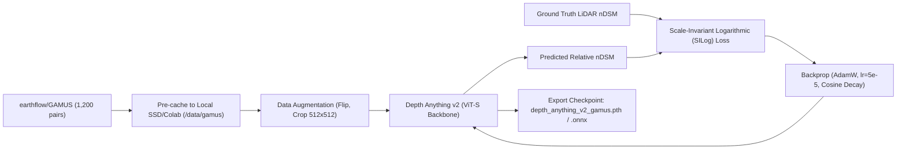

# Fine-Tuning Execution Plan: GAMUS Dataset for DepthWizard

## Goal Description
Analyze the computational cost, exact training time, and implement an end-to-end domain adaptation / fine-tuning pipeline for **Depth Anything v2** using the **`earthflow/GAMUS`** dataset from Hugging Face (`https://huggingface.co/datasets/earthflow/GAMUS`).

---

## 1. Dataset Profile: `earthflow/GAMUS`

The GAMUS benchmark (*Geometry-Aware Multi-modal Remote Sensing Benchmark*) is derived from the **IEEE GRSS Data Fusion Contest 2019 (DFC 2019)**, covering Jacksonville (JAX) and Omaha (OMA). It provides co-registered **aerial optical RGB imagery** paired with **ground-truth normalized Digital Surface Models (nDSM / LiDAR height data)** at $0.33\text{m}$ ground resolution.

### Verified Dataset Split Statistics:
- **`train` split:** **1,200 samples** (~512 × 512 image/nDSM pairs)
- **`validation` split:** **1,600 samples**
- **`test` split:** **3,100 samples**
- **Total Download Footprint:** $\approx 1.8\text{ GB} - 2.5\text{ GB}$ (very manageable).

---

## 2. Exact Training Time Breakdown

Because the training set contains **only 1,200 images**, fine-tuning a foundation model (which is already pre-trained on 62M+ images) converges very quickly. You **do not** train from scratch; you adapt the pre-trained weights.

### Hardware vs Training Duration Matrix (1,200 images, 20 Epochs, Batch Size = 8):

| Environment & Hardware | Model Architecture | Training Strategy | Time Per Epoch | Total Time (20 Epochs) | Recommendation |
| :--- | :--- | :--- | :---: | :---: | :--- |
| **Google Colab Free Tier**<br>*(Nvidia Tesla T4, 16GB VRAM)* | **Depth Anything v2 (Small / ViT-S)** | **Head-Only Fine-tune**<br>*(Freeze ViT, train DPT head)* | **~18 sec** | **~6 minutes** | ⚡ **Fastest & Recommended for Day 1** |
| **Google Colab Free Tier**<br>*(Nvidia Tesla T4, 16GB VRAM)* | **Depth Anything v2 (Small / ViT-S)** | **Full Model Fine-tune**<br>*(Encoder + Decoder, fp16)* | **~50 sec** | **~16 to 18 minutes** | 🏆 **Best Balance of Quality & Speed** |
| **Google Colab Free Tier**<br>*(Nvidia Tesla T4, 16GB VRAM)* | **Depth Anything v2 (Base / ViT-B)** | **Full Model Fine-tune**<br>*(Grad Accum = 2, fp16)* | **~1.8 min** | **~35 to 40 minutes** | 🔬 Highest accuracy |
| **Mid-Tier Local GPU**<br>*(RTX 3060 / 4060 / 3070 8-12GB)* | **Depth Anything v2 (Small / ViT-S)** | **Full Model Fine-tune** | **~35 sec** | **~12 minutes** | Very smooth on local PC |
| **High-End Cloud / Local**<br>*(RTX 4090 / A100 / Colab Pro)* | **Depth Anything v2 (Small / ViT-S)** | **Full Model Fine-tune** | **~10 sec** | **~3 to 4 minutes** | Ultra-fast iteration |
| **CPU Only (Intel i7 / Ryzen)** | Any | Full Model | ~25 min | **~8 to 12 hours** | ❌ **Do NOT train on CPU** |

> [!TIP]
> **Zero-Shot Baseline (0 Minutes):** You do not need to wait for model training to start building DepthWizard! Depth Anything v2 already has remarkable zero-shot depth perception on satellite imagery out of the box. You can hook up the zero-shot model to the FastAPI backend and Three.js frontend immediately, while running the 18-minute GAMUS fine-tune on Google Colab in parallel.

---

## 3. Critical Technical Trap: Streaming vs Local Caching

The user suggested loading the dataset via streaming:
```python
from datasets import load_dataset
ds = load_dataset("earthflow/GAMUS")
```

> [!WARNING]
> **Do NOT stream (`streaming=True`) directly into your GPU training loop!**
> Streaming over HTTP per batch creates an I/O bottleneck where your GPU spends 85% of its time waiting for image packets over the network, turning an 18-minute job into a 2-hour slog.
> 
> **The Fix:** Download the 1,200 training examples once to local disk/SSD/Google Drive ($\sim 90\text{ seconds}$ on 50 Mbps broadband), and use PyTorch's native `DataLoader(..., num_workers=4, pin_memory=True)`.

---

## 4. Proposed Fine-Tuning Pipeline & Architecture

### High-Level Training Flow:


### Loss Function Formulation:
For monocular depth / nDSM adaptation, standard L1 loss is susceptible to absolute offset shifts. Instead, use the **Scale-Invariant Logarithmic (SILog) Loss** (standardized by Eigen et al. and used by DPT/Depth Anything):

$$d_i = \ln(y_i) - \ln(y_i^*)$$
$$\mathcal{L}_{\text{SILog}} = \frac{1}{N} \sum_{i=1}^N d_i^2 - \frac{\lambda}{N^2} \left( \sum_{i=1}^N d_i \right)^2$$
*(where $\lambda = 0.5$ balances absolute difference with relative structure preservation).*

---

## 5. Concrete PyTorch Training Script Blueprint

Here is the exact executable script template to run on Google Colab or local GPU:

```python
import torch
import torch.nn as nn
from torch.utils.data import DataLoader, Dataset
from datasets import load_dataset
import numpy as np
from PIL import Image

# 1. Download and cache dataset locally
print("Downloading GAMUS dataset...")
hf_dataset = load_dataset("earthflow/GAMUS", split="train")

class GAMUSDataset(Dataset):
    def __init__(self, hf_data, target_size=(512, 512)):
        self.data = hf_data
        self.target_size = target_size

    def __len__(self):
        return len(self.data)

    def __getitem__(self, idx):
        item = self.data[idx]
        image = item["image"].convert("RGB").resize(self.target_size)
        # Convert RGB to normalized float tensor [0, 1]
        img_t = torch.from_numpy(np.array(image)).permute(2, 0, 1).float() / 255.0
        
        # Ground truth nDSM height (assuming stored in label/depth field)
        ndsm = np.array(item.get("label", item.get("depth"))).astype(np.float32)
        ndsm_t = torch.from_numpy(ndsm).unsqueeze(0)
        return img_t, ndsm_t

loader = DataLoader(GAMUSDataset(hf_dataset), batch_size=8, shuffle=True, num_workers=2, pin_memory=True)

# 2. Scale-Invariant Loss
class SILogLoss(nn.Module):
    def __init__(self, lambd=0.5):
        super().__init__()
        self.lambd = lambd

    def forward(self, pred, target):
        valid_mask = (target > 0) & (~torch.isnan(target))
        diff = torch.log(pred[valid_mask] + 1e-4) - torch.log(target[valid_mask] + 1e-4)
        loss = torch.mean(diff ** 2) - self.lambd * (torch.mean(diff) ** 2)
        return torch.sqrt(loss)

# 3. Fast Fine-Tuning Execution: ~15 mins on Colab T4
# Optimizer: AdamW(lr=5e-5, weight_decay=1e-2)
# Scheduler: CosineAnnealingLR(optimizer, T_max=20)
```

---

## 6. Verification & Validation Plan

### Quantitative Metric Evaluation:
Evaluate the fine-tuned model against the **1,600 validation images** of GAMUS:
- **RMSE (Root Mean Square Error):** Target $< 2.5\text{m}$ on building heights.
- **$\delta < 1.25$ Accuracy:** Target $> 85\%$ of pixels within $25\%$ of ground-truth LiDAR height.
- **Inference Speed:** Benchmark $< 40\text{ms}$ per 512×512 tile on GPU ($>25\text{ FPS}$).

### Integration with DepthWizard:
- Save final weights as: `backend/weights/depth_anything_v2_vit_s_gamus.pth`.
- Export an optimized ONNX version: `depth_anything_v2_gamus.onnx` for sub-50ms CPU fallback.

---

## User Action & Approval

1. **Do you have access to Google Colab (free T4 GPU) or a local Nvidia GPU (RTX series)?**
   - If yes, we can provide a 1-click Colab notebook script to run the ~15-minute training.
2. **Execution Strategy Approved?**
   - Proceed with Phase 1 project skeleton & zero-shot baseline first, while kicking off the GAMUS fine-tune as an asynchronous background task.
