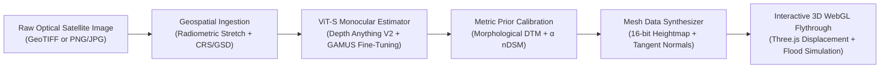
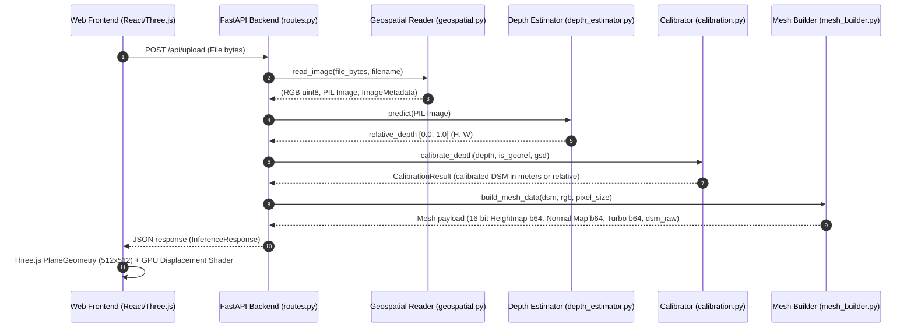
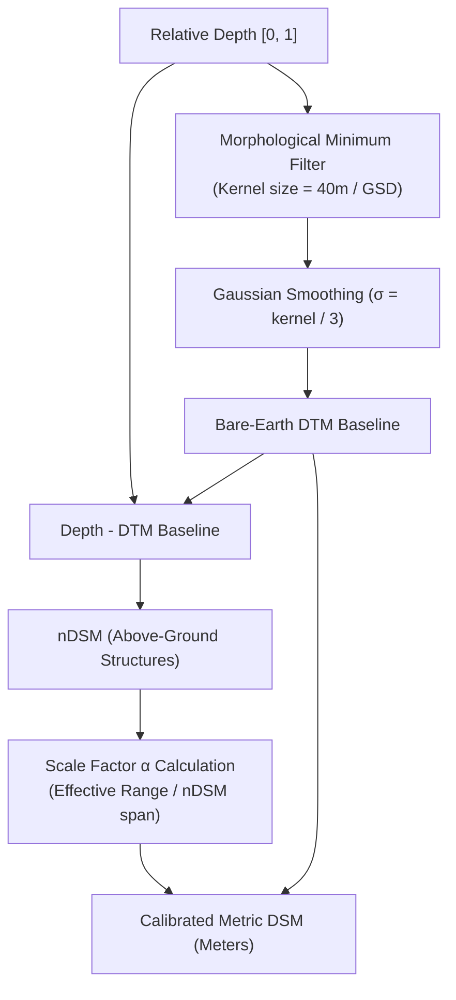

# DepthWizard: System Architecture & 3D Mesh Construction Report

---

## 1. Executive Brief: DepthWizard

**DepthWizard** is an AI-powered geospatial platform created for the **Space Applications Centre (ISRO SAC)** monocular 3D terrain reconstruction challenge (**SIH26175**). 

### Problem Statement
Traditional Digital Surface Model (DSM) generation relies on multi-pass stereo satellite pairs or airborne LiDAR surveys. These methods are:
* **Cost-prohibitive** for rapid reconnaissance.
* **Latency-constrained** during natural disasters (floods, landslides, earthquakes).
* **Sensor-dependent**, requiring specialized orbital constellations or flight authorizations.

### DepthWizard's Solution
DepthWizard reconstructs **high-fidelity 3D Digital Surface Models (DSMs)** directly from a **single monocular overhead optical satellite image** (GeoTIFF or standard PNG/JPG). 



---

## 2. Default & Placeholder Image Data Provenance

Where the website currently pulls its preset testbeds and sample imagery from:

### 2.1 The Two Primary Frontend Presets
In [`frontend/src/components/Dropzone.tsx`](../../frontend/src/components/Dropzone.tsx#L210-L300), the UI contains two pre-configured testbed cards:

| Preset Name | UI Identifier | Source File Location | File Size | Description |
|---|---|---|---|---|
| **Testbed A (GeoTIFF)** | `real_satellite_georef.tif` | [`frontend/public/sample_satellite_georef.tif`](../../frontend/public/sample_satellite_georef.tif) | `3.1 MB` | A genuine georeferenced satellite tile with embedded CRS (`EPSG:32617`), affine matrix, and calculated physical Ground Sampling Distance (GSD). Triggers metric elevation mode (meters). |
| **Testbed B (Optical)** | `real_satellite_urban.png` | [`frontend/public/sample_satellite_urban.png`](../../frontend/public/sample_satellite_urban.png) | `2.4 MB` | A dense high-resolution urban satellite tile without CRS metadata. Triggers relative elevation mode $[0.0, 1.0]$. |

### 2.2 Mechanism of Loading
When a user clicks either preset button in the UI:
1. The browser initiates a standard HTTP `fetch('/sample_satellite_georef.tif')` or `fetch('/sample_satellite_urban.png')` against the static assets in the Vite `/public` directory.
2. The returned bytes are encapsulated into a native JavaScript `File([blob], filename, { type: mime })` object.
3. The file is uploaded directly to `POST /api/upload`, exactly as if a user dragged it from their local desktop.

### 2.3 Standalone Evaluation Testbeds
In addition to the public folder assets, the root directory includes offline evaluation sets in [`test_datasets/`](test_datasets):
* [`test_datasets/geotiff_mode/`](../../test_datasets/geotiff_mode):
  * `01_geotiff_full_1024.tif` ($1024 \times 1024$, 3.0 MB)
  * `02_geotiff_downtown_512.tif` ($512 \times 512$, 770 KB)
  * `03_geotiff_residential_768.tif` ($768 \times 768$, 1.7 MB)
  * `04_geotiff_isro_utm43_512.tif` (Indian UTM Zone 43N CRS `EPSG:32643`, 770 KB)
* [`test_datasets/optical_mode/`](../../test_datasets/optical_mode):
  * `01_optical_urban_1024.png` ($1024 \times 1024$, 2.3 MB)
  * `02_optical_commercial_512.png` ($512 \times 512$, 588 KB)
  * `03_optical_residential_640.png` ($640 \times 640$, 932 KB)
  * `04_optical_district_512.jpg` ($512 \times 512$, 167 KB)

---

## 3. End-to-End Mesh Construction Pipeline

The construction of the 3D terrain mesh is a multi-stage process bridging **Computer Vision (PyTorch)**, **Geographic Information Systems (GDAL/Rasterio)**, **Digital Image Processing (NumPy/SciPy)**, and **GPU Vertex Shaders (Three.js WebGL)**.



---

### Step 3.1: Geospatial Ingestion & Radiometric Normalization
* **Module**: [`app/services/geospatial.py`](../../backend/app/services/geospatial.py)
* **Function**: `read_image()`

#### Operational Logic:
1. **Channel Handling**:
   * If single-band (Pan / Grayscale), replicates band across 3 channels: $[R, G, B] = [I, I, I]$.
   * If 2-band (e.g., dual-polarization SAR or Pan+NIR), synthesizes a 3rd channel via channel arithmetic: $C_3 = \frac{C_1 + C_2}{2}$.
   * If $\ge 3$ bands, extracts the primary 3 spectral bands.
2. **Radiometric Stretching**:
   Raw satellite imagery is rarely 8-bit. Sensors produce 11-bit, 12-bit, or 16-bit integer rasters with narrow dynamic ranges. If passed directly to a Vision Transformer, features appear completely black.
   * Computes the 2nd and 98th percentiles ($P_2, P_{98}$) on finite pixels.
   * Performs min-max contrast stretching:
     $$I_{\text{stretched}}(x, y) = \text{clip}\left(\frac{I(x, y) - P_2}{P_{98} - P_2}, 0, 1\right) \times 255.0$$
3. **Georeference & GSD Extraction**:
   * Inspects raster transform matrix: $\begin{bmatrix} a & b & c \\ d & e & f \end{bmatrix}$.
   * Calculates pixel resolution: $\text{GSD} = \sqrt{a^2 + d^2}$ (accounting for rotated/sheared rasters).
   * **Geographic CRS Conversion**: If the coordinate system is in angular degrees (`EPSG:4326`), pixel size is converted to physical meters using the central latitude:
     $$\text{GSD}_{\text{meters}} = \text{GSD}_{\text{deg}} \times 111,320.0 \times \cos(\phi_{\text{center}})$$

---

### Step 3.2: Deep Learning Inference (ViT-S)
* **Module**: [`app/services/depth_estimator.py`](../../backend/app/services/depth_estimator.py)
* **Model**: `Depth-Anything-V2-Small-hf` fine-tuned on `earthflow/GAMUS`

#### Operational Logic:
1. Converts the PIL image to PyTorch tensors and runs forward inference on the Vision Transformer backbone.
2. Upsamples the predicted latent depth to original image dimensions $(H, W)$ using bicubic interpolation (`align_corners=False`).
3. **Outlier Filtering**: Trims radiometric edge artifacts by clipping between the 0.5th and 99.5th percentiles ($P_{0.5}, P_{99.5}$), followed by strict normalization into $[0.0, 1.0]$.
4. **Epistemic Uncertainty Estimation (MC Dropout)**: When requested, performs $N=5$ forward passes with active dropout layers to compute spatial variance $\sigma^2(x, y)$, returning a pixel-level confidence map:
   $$\text{Confidence}(x, y) = 1.0 - \frac{\sigma^2(x, y)}{\max(\sigma^2)}$$

---

### Step 3.3: Two-Component Elevation Decomposition
* **Module**: [`app/services/calibration.py`](../../backend/app/services/calibration.py)
* **Function**: `calibrate_depth()`

Monocular depth models predict relative disparity, not absolute altitude. DepthWizard uses a two-component physical decomposition:

$$DSM(x, y) = DTM_{\text{base}}(x, y) + \alpha \cdot nDSM(x, y)$$



#### The Math:
1. **Bare-Earth Topography Extraction ($DTM_{\text{base}}$)**:
   Ground is modeled by applying a spatial morphological minimum filter with a kernel size representing standard maximum building footprints ($\sim 40\text{m}$ in physical scale):
   $$K_{\text{px}} = \text{clip}\left(\frac{40.0}{\text{GSD}}, 3, \frac{\min(H, W)}{6}\right)$$
   This removes buildings and vegetation, leaving the ground surface. A Gaussian filter ($\sigma = K_{\text{px}} / 3$) smooths artificial stair-stepping.
2. **Normalized Digital Surface Model ($nDSM$)**:
   The structural height above ground is isolated:
   $$nDSM(x, y) = \max(Depth(x, y) - DTM_{\text{base}}(x, y), 0.0)$$
3. **Scale Factor ($\alpha$)**:
   Ground Sampling Distance dictates the visible spatial extent. Fine GSD ($0.3\text{m}$) resolves single buildings ($30\text{-}50\text{m}$ height), while coarser GSD ($5\text{m}$) encompasses regional ridges and tall towers. The effective height range is scaled:
   $$\text{Range}_{\text{eff}} = \text{Range}_{\text{target}} \times \text{clip}\left(\sqrt{\frac{\text{GSD}}{0.5}}, 0.7, 3.0\right)$$
   $$\alpha = \frac{\text{Range}_{\text{eff}}}{P_{99}(nDSM) - P_{5}(nDSM)}$$
4. **Final Composite DSM**:
   $$DSM(x, y) = \left(DTM_{\text{base}}(x, y) - \min(DTM_{\text{base}})\right) \times (0.4\alpha) + \alpha \cdot nDSM(x, y)$$

---

### Step 3.4: Mesh Synthesis & Asset Generation
* **Module**: [`app/services/mesh_builder.py`](../../backend/app/services/mesh_builder.py)
* **Function**: `build_mesh_data()`

To achieve instantaneous rendering without sending gigabytes of raw 3D polygon vertex buffers over HTTP, DepthWizard decouples geometry from displacement:

#### 1. Grid Decimation:
If the input resolution exceeds $512 \times 512$, the elevation field is decimated using bilinear interpolation (`scipy.ndimage.zoom`) to a maximum dimension of 512. This bounds the client-side vertex count to $\le 262,144$ vertices and $\le 524,288$ triangles, ensuring stable 60 FPS WebGL frame rates on standard laptops.

#### 2. 16-Bit Displacement Heightmap:
The decimated elevation grid is normalized to $[0, 1]$ and mapped to a 16-bit integer array:
$$I_{16}(x, y) = \text{round}\left(\frac{DSM(x, y) - \min(DSM)}{\max(DSM) - \min(DSM)} \times 65535\right)$$
Saved as an uncompressed 1-channel 16-bit PNG (`PIL mode='I;16'`) and base64-encoded. 16-bit depth gives **65,536 distinct height increments**, eliminating terrace/banding artifacts that occur with standard 8-bit heightmaps.

#### 3. Tangent-Space Surface Normal Map:
To give the 3D terrain realistic lighting and shadow relief without requiring millions of physical vertices, the backend pre-computes analytical surface normal vectors using central difference gradient operators:
$$\nabla DSM = \left(\frac{\partial DSM}{\partial x}, \frac{\partial DSM}{\partial y}\right)$$
The tangent-space surface normal vector $\vec{N}$ is:
$$\vec{N} = \frac{\begin{bmatrix} -g_x \cdot s_v \\ g_y \cdot s_v \\ 1.0 \end{bmatrix}}{\sqrt{(g_x s_v)^2 + (g_y s_v)^2 + 1.0}}$$
The unit normal is encoded into standard RGB color space ($[-1, 1] \to [0, 255]$):
$$R = \lfloor(N_x \cdot 0.5 + 0.5) \cdot 255\rfloor, \quad G = \lfloor(N_y \cdot 0.5 + 0.5) \cdot 255\rfloor, \quad B = \lfloor(N_z \cdot 0.5 + 0.5) \cdot 255\rfloor$$

#### 4. Turbo Depth Colormap:
A 256-step scientific Turbo lookup table (Blue $\to$ Cyan $\to$ Green $\to$ Yellow $\to$ Red) is applied to produce the 2D depth visualization tile.

---

### Step 3.5: Client-Side WebGL Rendering Engine
* **Module**: [`frontend/src/components/TerrainCanvas.tsx`](../../frontend/src/components/TerrainCanvas.tsx)
* **Libraries**: `@react-three/fiber`, `@react-three/drei`, `three.js`

#### 1. Geometric Primitive:
```typescript
const geometry = useMemo(() => {
  const w = meshStats.width;
  const h = meshStats.height;
  const segments = Math.min(w, 512);
  return new THREE.PlaneGeometry(w * 0.1, h * 0.1, segments, segments);
}, [meshStats]);
```
The terrain plane is rotated $-90^\circ$ around the X-axis (`rotation={[-Math.PI / 2, 0, 0]}`) so that the Y-axis points upward (world elevation).

#### 2. GPU Displacement Shader:
Rather than transforming vertex arrays in JavaScript, Three.js's native vertex shader reads the 16-bit heightmap on the GPU:
```tsx
<meshStandardMaterial
  map={colorTex}
  displacementMap={heightTex}
  displacementScale={displacementScale}
  displacementBias={0}
  normalMap={normalTex}
  normalScale={isRelative ? new THREE.Vector2(2.0, 2.0) : new THREE.Vector2(1.2, 1.2)}
  roughness={0.7}
  metalness={0.1}
/>
```
* **Displacement Scaling Math**:
  * **Metric Mode**: $S_{\text{disp}} = \text{elevation\_range} \times \text{verticalScale} \times 0.1$.
  * **Relative Mode**: $S_{\text{disp}} = 18.0 \times \text{verticalScale}$ (scales $[0, 1]$ relative depths to a visible 18-unit height relief across the 51.2-wide plane).

#### 3. Real-Time Topographic Contour Injection:
In `onBeforeCompile`, DepthWizard modifies Three.js's fragment shader at runtime. It captures `vTerrainWorldPos.y` and applies screen-space derivatives `fwidth()` to draw anti-aliased analytical contour lines directly onto the 3D surface:
```glsl
float elev = uElevationMin + (vTerrainWorldPos.y / vScale);
float numIntervals = elev / uContourInterval;
float dist = abs(numIntervals - floor(numIntervals + 0.5)) * uContourInterval;
float dElev = max(fwidth(elev), 0.001);
float line = 1.0 - smoothstep(0.0, dElev * 1.5, dist);
```
Major index contours are automatically highlighted every $5 \times$ intervals.

#### 4. Synchronized Hydrologic Water Plane:
When the user adjusts the Flood Simulator slider, a secondary translucent blue water plane (`color="#0077be"`, `opacity=0.55`) is dynamically positioned at:
$$Y_{\text{water}} = (\text{waterLevel} - \text{elevation\_min}) \times \text{verticalFactor} + 0.05$$
This immediately intersects the displaced terrain geometry, showing submerged valleys and isolated structural islands.

---

## 4. Key Strengths, Edge Cases & Future Optimization

### Strengths
1. **Sub-Second Latency**: Full inference, calibration, and mesh synthesis completes in $< 900\text{ms}$ on CPU/Apple Silicon and $< 100\text{ms}$ on NVIDIA GPU.
2. **16-Bit Precision**: 65,536 vertical levels prevent the ugly stair-stepping artifacts common in 8-bit heightfields.
3. **Dual Metric/Relative Engine**: Transparently switches between true georeferenced metric elevations and normalized relative depth.
4. **Zero GPU Memory Leakage**: Explicit cleanup hooks (`tex.dispose()`, `geometry.dispose()`) ensure continuous uploads do not crash WebGL contexts.

### Current Limitations & Recommendations
* **Coarse Resolution Decimation**: Large satellite swaths ($4096 \times 4096$) are decimated to $512 \times 512$ for WebGL rendering. For high-resolution local zooms, hierarchical Level of Detail (LOD) tiling (e.g., QuadTree / 3D Tiles) could be introduced.
* **Under-Shadow Depth Artifacts**: Monocular vision models can mistake cast shadows of skyscrapers for deep depressions. The Sobel gradient loss in GAMUS fine-tuning reduces this, but a dedicated shadow detection mask could further isolate true ground.

---

*Report generated and archived in `reports/mesh_construction_and_project_architecture.md`*.
