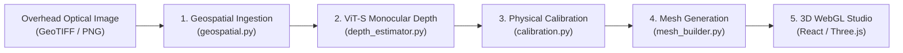

# DepthWizard: AI & Developer Onboarding Brief

> **Target Audience**: AI agents and developers onboarding onto DepthWizard.  
> **Purpose**: High-density primer covering project mission, system architecture, runtime environments, data contracts, and rules of engagement.

---

## 1. What is DepthWizard?

**DepthWizard** is an AI-powered geospatial platform created for the **Space Applications Centre (ISRO SAC)** (Challenge: **SIH26175**).

* **The Problem**: Conventional Digital Surface Models (DSMs) require multi-pass stereo satellite pairs or airborne LiDAR surveys—both are expensive, slow, and unavailable during rapid-response natural disasters.
* **The Solution**: DepthWizard reconstructs **high-fidelity 3D Digital Surface Models (DSMs)** directly from a **single overhead optical satellite image** (GeoTIFF or standard PNG/JPG) in sub-second inference time.
* **Key Deliverables**:
  1. High-accuracy physical metric elevation grids (GeoTIFF in meters tied to CRS projections).
  2. Dual 3D WebGL Flythrough modes (**Smooth Photoreal** vs. **Quantized Voxel/Minecraft-style**).
  3. Live hydrologic flood disaster simulation.
  4. Real-time elevation transect profiler.
  5. 32-bit OGC GeoTIFF export.

---

## 2. Quick-Start & Server Commands

> [!IMPORTANT]
> **STRICT RULE**: Always run backend commands inside the dedicated conda environment: `depthwizard`.  
> Do **NOT** install random global packages, modify global python, or create ad-hoc virtual environments.

### Terminal 1: Backend API (FastAPI + PyTorch)
```bash
cd backend
conda activate depthwizard
python run_server.py
```
* **Host**: `http://127.0.0.1:8000`
* **Health Check**: `GET http://127.0.0.1:8000/api/health`
* **Swagger Docs**: `http://127.0.0.1:8000/docs`

### Terminal 2: Frontend Web App (React 18 + Vite + Three.js)
```bash
cd frontend
npm run dev
```
* **Host**: `http://localhost:5173` (automatically proxies `/api` requests to port 8000).
* **Unit Tests**: `npm test` (executes pure voxel/math tests in Node v22).
* **Production Build**: `npm run build` (`tsc && vite build`).

---

## 3. End-to-End Pipeline Architecture



### Stage 1: Geospatial Ingestion ([`backend/app/services/geospatial.py`](../../backend/app/services/geospatial.py))
* Supports GeoTIFF (`.tif`, `.tiff`), PNG, JPG.
* Automatic band synthesis (synthesizes 3-channel RGB from 1-band grayscale or 2-band dual-pol rasters).
* **Radiometric Percentile Stretching**: 2%-98% contrast normalization handles 11/12/16-bit high dynamic range satellite rasters.
* Extracts affine transform, CRS (e.g. `EPSG:32617`, `EPSG:32643`), and physical Ground Sampling Distance (GSD in meters).

### Stage 2: AI Depth Inference ([`backend/app/services/depth_estimator.py`](../../backend/app/services/depth_estimator.py))
* **Backbone**: `Depth-Anything-V2-Small-hf` (Vision Transformer, ~24.8M parameters).
* **Fine-Tuned Checkpoint**: [`backend/weights/best_model.pth`](../../backend/weights/best_model.pth) adapted on `earthflow/GAMUS` (DFC 2019 aerial optical + LiDAR nDSM ground truth).
* Bicubic upsampling back to native input dimensions $(W, H)$.
* Percentile clipping ($P_{0.5} - P_{99.5}$) suppresses sensor edge noise; normalizes to relative disparity $[0.0, 1.0]$.
* Optional Monte Carlo Dropout (5 passes) generates pixel-level confidence maps.

### Stage 3: Two-Component Elevation Calibration ([`backend/app/services/calibration.py`](../../backend/app/services/calibration.py))
* Physical decomposition formula:
  $$DSM(x, y) = DTM_{\text{base}}(x, y) + \alpha \cdot nDSM(x, y)$$
* **Bare-Earth Extraction**: Morphological minimum filter ($K_{\text{px}} = 40\text{m}/\text{GSD}$) + Gaussian smoothing isolates ground baseline $DTM_{\text{base}}$.
* **Structural Isolation**: Above-ground building height: $nDSM = \max(Depth - DTM_{\text{base}}, 0.0)$.
* **Metric Scaling Factor ($\alpha$)**: Maps normalized structural variation to true physical meters based on GSD.
* Non-georeferenced images default to calibrated relative range $[0.0, 1.0]$.

### Stage 4: Mesh Synthesis & Decimation ([`backend/app/services/mesh_builder.py`](../../backend/app/services/mesh_builder.py))
* Proportional decimation to $\le 512 \times 512$ bounds client-side vertex count for guaranteed 60 FPS WebGL rendering.
* **Outputs Generated**:
  1. `heightmap_b64`: 16-bit single-channel PNG (`PIL mode='I;16'`) with 65,536 elevation steps (eliminates 8-bit terrace banding).
  2. `normal_map_b64`: Pre-computed tangent-space surface normal vectors ($\nabla DSM$) for GPU relief lighting.
  3. `dsm_colorized_b64`: 2D Turbo colormap visualization tile.
  4. `dsm_raw`: 2D row-major float array (`number[][]`) for instantaneous client-side calculations.

---

## 4. Frontend 3D Studio & Features ([`frontend/src/`](../../frontend/src))

* **Main 3D Viewport**:
  * **Voxel / Block Mode ([`VoxelTerrain.tsx`](../../frontend/src/components/VoxelTerrain.tsx))**: Quantized block extrusion using `THREE.InstancedMesh` (single draw call). Ground-anchored at $y=0$, configurable discrete Turbo elevation bands (5–12), block resolution slider (24–96), and Minecraft-style block gap margins.
  * **Smooth Photoreal Mode ([`TerrainCanvas.tsx`](../../frontend/src/components/TerrainCanvas.tsx))**: Continuous Three.js `PlaneGeometry` vertex displacement with dynamic runtime GLSL contour lines (`fwidth()`).
* **Photoreal Minimap ([`Minimap.tsx`](../../frontend/src/components/Minimap.tsx))**: Floating top-right overlay running a locked, non-interactive second WebGL canvas for overview reference.
* **Analytical Tabs (Right Sidebar)**:
  * `01 SURFACE`: Render mode toggle (`Voxel` vs `Smooth`), discrete band slider with live Turbo color swatches, block resolution slider, vertical exaggeration ($0.1\times - 5.0\times$), contour interval tuning, and spatial telemetry.
  * `02 FLOOD`: Real-time hydrologic flood slider with water plane elevation and live submerged percentage curve.
  * `03 PROFILE`: 256-sample west-to-east elevation cross-section transect with min/peak/average readout.
  * `04 INSPECT`: Dual 2D split viewer comparing optical RGB tile with Turbo colorized depth.

---

## 5. Repository File Map

```
depthwizard/
├── backend/
│   ├── app/
│   │   ├── api/
│   │   │   ├── routes.py          # /api/health, /api/upload, /api/export/{id}
│   │   │   └── schemas.py         # Pydantic request/response models
│   │   ├── services/
│   │   │   ├── geospatial.py      # GeoTIFF/PNG reader, CRS, GSD, contrast stretching
│   │   │   ├── depth_estimator.py # Depth Anything v2 ViT-S inference engine
│   │   │   ├── calibration.py     # Two-component DTM + alpha nDSM decomposition
│   │   │   ├── mesh_builder.py    # Decimation, 16-bit heightmap, normal map, dsm_raw
│   │   │   └── validation.py      # Metric computation (RMSE, delta accuracy)
│   │   ├── config.py              # Path constants, model ID, limits
│   │   ├── logging_config.py      # Structlog JSON/console logger
│   │   └── main.py                # FastAPI lifecycle & CORS setup
│   ├── run_server.py              # Production backend entry point (port 8000)
│   ├── weights/                   # best_model.pth fine-tuned checkpoint
│   └── tests/                     # Backend pipeline integration tests
├── frontend/
│   ├── src/
│   │   ├── components/
│   │   │   ├── TerrainCanvas.tsx  # Smooth Three.js displacement & contour shader
│   │   │   ├── VoxelTerrain.tsx   # InstancedMesh voxel block renderer
│   │   │   ├── Minimap.tsx        # Floating secondary non-interactive overview canvas
│   │   │   ├── SettingsPanel.tsx  # Surface tab controls (render mode, bands, resolution)
│   │   │   ├── FloodSimulator.tsx # Waterline slider & submerged area analytics
│   │   │   ├── CrossSection.tsx   # Centerline elevation transect Recharts profiler
│   │   │   ├── DualViewer.tsx     # 2D optical vs. Turbo depth split viewer
│   │   │   └── Dropzone.tsx       # Drag-and-drop ingestion & testbed presets
│   │   ├── lib/
│   │   │   ├── voxelize.ts        # Pure area-averaging pooling & palette quantization
│   │   │   └── voxelize.test.ts   # Node v22 unit test suite
│   │   ├── hooks/useInference.ts  # API communication & loading state management
│   │   └── App.tsx                # Main layout, viewport, and tab router
│   ├── public/                    # Preset GeoTIFF & PNG sample assets
│   ├── vite.config.ts             # Vite configuration with backend proxy
│   └── package.json               # Three.js r174, R3F, Recharts, TailwindCSS v4
├── test_datasets/
│   ├── geotiff_mode/              # Sample georeferenced GeoTIFF tiles (including ISRO UTM43)
│   └── optical_mode/              # High-res optical urban/commercial PNG tiles
└── reports/                       # Technical audits and architecture documents
```

---

## 6. Rules of Engagement for New Agents

1. **Backend Modifications**:
   * Do not touch `geospatial.py`, `depth_estimator.py`, or `calibration.py` unless explicitly tasked with fine-tuning or geospatial math fixes.
   * Do not change `dsm_raw` payload schema: the frontend relies on it being a row-major 2D array (`number[][]`).
2. **Environment Discipline**:
   * Never install random global Python packages or spin up separate virtual environments. Always execute within `/opt/anaconda3/envs/depthwizard`.
3. **WebGL Performance Budget**:
   * Target **60 FPS locked** on standard laptops.
   * Decimate meshes on server to $\le 512 \times 512$.
   * Use `THREE.InstancedMesh` for repeated geometries (never instantiate thousands of independent meshes).
   * Always clean up GPU memory on unmount (`tex.dispose()`, `geometry.dispose()`).
4. **Coordinate & Anchoring Conventions**:
   * Plane center sits at world origin $[0, 0, 0]$.
   * World $+Y$ is vertical elevation.
   * Voxel blocks must always anchor their **base** at $y=0$ (`position.y = height / 2`, `scale.y = height`).
