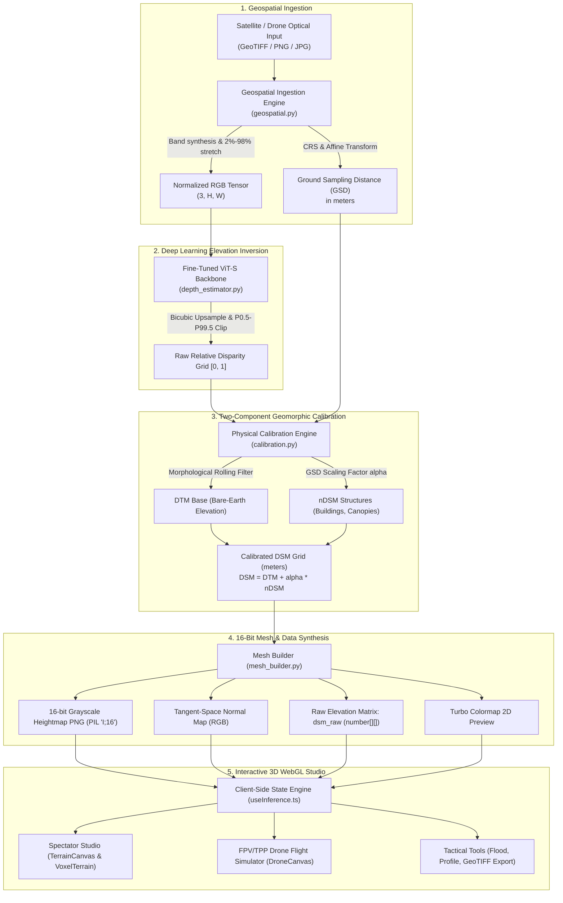
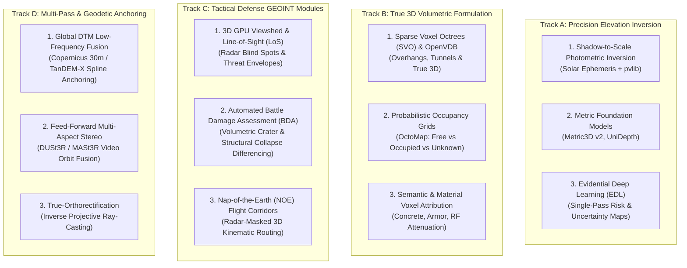

# DepthWizard: Comprehensive Technical Brief & Consultant Dossier

> **Document Class**: Technical Architecture Brief & Systems Dossier  
> **Prepared For**: Technical Consultants, Research Partners & Geospatial Defense Engineers  
> **Repository**: `tanishqkr/satellite-image-to-3d-terrain`
> **Problem Statement**: SIH26175 — Space Applications Centre (ISRO SAC)  
> **Date**: September 2026  

---

## 1. Executive Summary & Operational Mission

**DepthWizard** is an AI-native 3D Geospatial Intelligence (GEOINT) and tactical simulation platform. It bridges the gap between single-view optical satellite/aerial reconnaissance and high-resolution 3D Digital Surface Models (DSMs).

### 1.1 The Operational Challenge
In tactical defense reconnaissance, disaster response (flash flooding, landslides), and remote terrain navigation, traditional 3D topography acquisition faces fatal bottlenecks:
* **Multi-View Stereo (MVS)** requires multiple overlapping satellite passes or orbital baselines, taking hours to days.
* **Airborne LiDAR** requires crewed aircraft or slow survey drones flying directly into contested or hazardous airspace.
* **Existing Global DEMs** (e.g., SRTM 30m, Copernicus 30m) lack local structural elevation, building footprints, and recent infrastructure changes.

### 1.2 The DepthWizard Solution
DepthWizard solves this with an end-to-end neural and geometric pipeline that transforms a **single overhead optical image** (high-resolution satellite GeoTIFF or standard aerial RGB capture) into an **accurate, physically scaled 3D Digital Surface Model (DSM)** in **sub-second inference time**, complete with:
1. **Physical Elevation Inversion**: Calibrated in true physical meters above ground level (AGL) and sea level (MSL).
2. **Dual-Representation 3D Rendering**: Real-time switching between **Continuous Photoreal Displaced Terrains** and **Quantized Voxel/Minecraft-Style Instanced Volumetric Terrains**.
3. **Tactical Hydrologic Simulation**: Live flood inundation modeling with real-time submerged area analytics.
4. **Elevation Transect Metrology**: 256-point elevation cross-section profiling with statistical min/max/average indicators.
5. **Interactive FPV & TPP Drone Flight Simulator**: Complete with real-time 6-DoF flight dynamics, analytical proximity ray-marching against the elevation grid, obstacle collision avoidance, and military-grade Head-Up Display (OSD/HUD) telemetry.
6. **OGC-Compliant Export**: Instant generation of 32-bit floating-point Cloud-Optimized GeoTIFFs (COG) with embedded Coordinate Reference Systems (CRS) and affine geotransforms.

---

## 2. End-to-End System Architecture

DepthWizard is partitioned into a high-performance **FastAPI / PyTorch backend** and a hardware-accelerated **React 18 / Three.js frontend**.



---

## 3. Deep Learning & Geospatial Backend Pipeline

### 3.1 Geospatial Ingestion Engine (backend/app/services/geospatial.py)
* **Format Flexibility**: Consumes standard rasters (PNG, JPEG, WebP) and multi-spectral/panchromatic GeoTIFFs (`.tif`, `.tiff`) using `rasterio`.
* **Automatic Band Synthesis**:
  * 1-band rasters (panchromatic/grayscale) are broadcast across 3 RGB channels.
  * 2-band rasters (e.g. SAR VV/VH dual-pol) are synthesized into 3-channel representations via channel combination: $[B_1, B_2, 0.5 \cdot (B_1 + B_2)]$.
* **Radiometric Dynamic Range Normalization**: Satellite sensors capture 11-bit, 12-bit, or signed 16-bit integers with extreme outliers (cloud glint, deep water absorption). DepthWizard applies a **2%–98% cumulative percentile stretch** to map native sensor values into optimal $[0, 255]$ RGB perceptual dynamic range.
* **Georeferencing & GSD Extraction**:
  * Reads the affine transform matrix:
    $$\begin{pmatrix} x_{geo} \\ y_{geo} \end{pmatrix} = \begin{pmatrix} a & b \\ d & e \end{pmatrix} \begin{pmatrix} x_{px} \\ y_{px} \end{pmatrix} + \begin{pmatrix} c \\ f \end{pmatrix}$$
  * If coordinate system is geodetic (`EPSG:4326` in degrees), calculates latitude-dependent metric GSD using the WGS84 ellipsoid:
    $$GSD = \sqrt{|a \cdot e - b \cdot d|} \cdot 111{,}320 \cdot \cos\left(\frac{\text{lat}_{rad}}{2}\right)$$
  * Supports projected coordinate systems (UTM zones like `EPSG:32617`, `EPSG:32643`).

### 3.2 Vision Transformer Inference Engine (backend/app/services/depth_estimator.py)
* **Backbone**: `Depth-Anything-V2-Small-hf` based on the Vision Transformer (ViT-S, ~24.8M parameters).
* **Fine-Tuned Checkpoint**: `backend/weights/best_model.pth`. Fine-tuned on the HuggingFace `earthflow/GAMUS` dataset (IEEE DFC 2019 Jacksonville/Omaha aerial optical images paired with airborne LiDAR normalized DSMs).
* **Mathematical Loss Function**:
  $$\mathcal{L}_{\text{total}} = \mathcal{L}_{\text{StableSILog}} + 0.5 \cdot \mathcal{L}_{\text{Gradient}}$$
  * **StableSILogLoss**: Scale-Invariant Logarithmic loss stabilized with $\log(1 + \gamma \cdot y)$ formulation to prevent negative or zero division instability, evaluated sample-by-sample to eliminate batch-coupling bias.
  * **GradientMatchingLoss**: Multi-scale spatial gradient difference loss enforcing crisp building boundaries and ridge definitions.
* **Uncertainty Estimation**: Equipped with Monte Carlo Dropout inference (5 passes) to compute per-pixel variance/confidence maps.

### 3.3 Two-Component Elevation Calibration (backend/app/services/calibration.py)
Single-image monocular vision outputs an affine-disparity representation without absolute scale or base terrain curvature. DepthWizard implements a geomorphic two-component decomposition:
$$DSM(x, y) = DTM_{\text{base}}(x, y) + \alpha \cdot nDSM(x, y)$$
1. **Bare-Earth DTM Isolation**:
   * Evaluates physical building footprints using a spatial footprint kernel:
     $$K_{px} = \text{clamp}\left(\left\lfloor\frac{40\text{ meters}}{GSD}\right\rfloor, 5, 51\right)$$
   * Runs a rolling morphological minimum filter over disparity, followed by Gaussian smoothing ($\sigma = K_{px}/3$), separating the underlying topography ($DTM_{\text{base}}$) from erected structures.
2. **Above-Ground Structural Isolation (nDSM)**:
   $$nDSM(x, y) = \max\left(Depth(x, y) - DTM_{\text{base}}(x, y), 0.0\right)$$
3. **Metric Scale Factor ($\alpha$) Formulation**:
   * For georeferenced satellite data, scales structural building variations to physical meters based on GSD and scene coverage:
     $$\alpha = \text{clamp}\left(15.0 \cdot \sqrt{\frac{GSD}{0.5}}, 5.0, 150.0\right)\text{ meters}$$
   * Non-georeferenced optical images fall back to statistical urban height priors (defaulting to relative $[0.0, 1.0]$ or 50m structural envelope).

### 3.4 16-Bit Mesh & Payload Synthesis (backend/app/services/mesh_builder.py)
To guarantee 60 FPS in WebGL without memory exhaustion:
1. **Decimation**: Grids are proportionally decimated down to $\le 512 \times 512$ cells.
2. **16-bit PNG Heightmap**: Encoded as a single-channel 16-bit unsigned grayscale PNG (`PIL mode='I;16'`). This provides **65,536 distinct elevation levels** (eliminating the stair-stepping terrace artifacts of standard 8-bit heightmaps).
3. **Tangent-Space Normal Map**: Computes discrete central difference gradients on the GPU displacement mesh:
   $$N_x = -\frac{\partial Z}{\partial X}, \quad N_y = -\frac{\partial Z}{\partial Y}, \quad N_z = 1.0 \implies \vec{N} = \frac{(N_x, N_y, N_z)}{\|\vec{N}\|}$$
4. **`dsm_raw` Matrix**: Delivers the calibrated float values as a row-major 2D array (`number[][]`) enabling instantaneous zero-latency client-side arithmetic.

---

## 4. Frontend 3D Studio & Simulation Engine

The frontend is built on **React 18, Vite, Three.js (r174), and `@react-three/fiber`**.

### 4.1 Dual-Mesh Rendering Architecture
DepthWizard features two distinct, synchronized 3D rendering modes:

| Feature | Smooth Photoreal Mode (`TerrainCanvas.tsx`) | Quantized Voxel Mode (`VoxelTerrain.tsx`) |
| :--- | :--- | :--- |
| **Geometry** | `THREE.PlaneGeometry(30, 30, 256, 256)` | `THREE.InstancedMesh` with unit box geometry |
| **Elevation Method** | Continuous GPU vertex displacement shader | Pure area-pooled discrete column heights |
| **Visual Texture** | Original satellite RGB texture + hillshade | Palette-quantized Turbo colormap (5–12 bands) |
| **Draw Calls** | 1 Draw Call | 1 Draw Call (`InstancedMesh`) |
| **Base Anchoring** | Elevated surface sheet | Ground-anchored pillars ($y=0$ to $y=\text{height}$) |
| **Primary Use Case** | Photorealistic flyby, visual feature inspection | Volumetric spatial planning, clearance zoning |

### 4.2 Pure Mathematical Voxelizer (frontend/src/lib/voxelize.ts)
* **Area-Average Spatial Pooling**: Downsamples arbitrary $H \times W$ DSMs into a uniform $N \times M$ grid (resolution slider 24–96). Uses exact pixel coverage area-averaging with zero edge distortion.
* **Palette Quantization**: Divides the elevation range into $B$ discrete bands (5–12 bands). Computes unique Turbo colormap RGB stops and hex values with zero division protection.
* **Instanced Transformation**: Every voxel column's 3D transformation matrix is calculated in a single linear pass:
  $$\text{position} = (x, h/2, z), \quad \text{scale} = (w_{block} \cdot 0.95, h, d_{block} \cdot 0.95)$$
  The $0.95\times$ scale introduces a distinct $5\%$ Minecraft-style margin gap between blocks, emphasizing structural contours.

### 4.3 Analytical Suite (Right Sidebar)
1. **01 SURFACE**: Render mode toggle (`Voxel` vs `Smooth`), Turbo band count slider (5–12), block resolution slider (24–96), vertical exaggeration slider ($0.1\times - 5.0\times$), contour interval slider (1m–50m), and live spatial telemetry.
2. **02 FLOOD**: Hydrologic flood simulator. An interactive water plane slider ($0.0\text{m} - 1.0\text{m}$) renders a dynamic transparent blue plane with live calculation of submerged surface area percentage ($0\% - 100\%$).
3. **03 PROFILE**: 256-sample west-to-east elevation cross-section transect with min, peak, and average readouts rendered via Recharts.
4. **04 INSPECT**: Dual 2D split viewer with draggable separator comparing the optical satellite RGB tile against the Turbo-colorized elevation map.
5. **Photoreal Minimap (`Minimap.tsx`)**: An isolated, locked top-down camera rendering the terrain in an upper-right viewport overlay for situational awareness.

---

## 5. FPV & TPP Drone Flight Simulator Mode

DepthWizard contains an isolated, tactical drone simulator located in `frontend/src/components/drone/`.

```
frontend/src/components/drone/
├── DroneCanvas.tsx             # Master flight R3F viewport, lighting, and camera modes
├── DroneFlightController.tsx   # 6-DoF physics loop, momentum, collision response, HUD telemetry
├── DroneHUD.tsx                # Aviation-grade OSD: horizon ladder, compass, VSI, alarms
├── DroneModel.tsx              # Procedural 11-mesh quadcopter (carbon frame, spinning rotors, LEDs)
├── DroneTerrainMesh.tsx        # Dual-mesh flight ground (smooth continuous vs voxelized)
├── ProximitySensors.tsx        # 3-sensor array visualization (dynamic laser beams)
├── dsmSampling.ts              # Sub-millisecond CPU ray-marching against dsm_raw
├── useDroneInput.ts            # WASD + QE + RF smooth key-state tracking
└── TerrainQuickPanel.tsx       # In-flight HUD glass overlay for on-the-fly terrain tuning
```

### 5.1 Procedural Quadcopter Model (`DroneModel.tsx`)
* Procedural Three.js geometry requiring zero external GLTF/OBJ assets:
  * Central carbon-fiber avionics pod with status LED.
  * 4 angled carbon-composite motor arms ($X$-frame layout).
  * 4 brushless motor pods with landing skids.
  * 4 counter-rotating translucent propeller discs with continuous rotation.
  * Dual forward green navigation LEDs and dual rear red orientation LEDs.
* Visual scale dynamically adjustable in-flight from **$0.5\times$ to $3.0\times$** via HUD slider.

### 5.2 Flight Physics & Dynamics (`DroneFlightController.tsx`)
* **Full 6-DoF Integration**:
  * Keyboard mapping: `W`/`S` (Thrust/Pitch), `A`/`D` (Lateral Strafe), `Q`/`E` (Yaw Rotation), `Space`/`Shift` or `R`/`F` (Ascend/Descend).
  * Auto-Bank Roll: Translating laterally automatically banks the drone up to $\pm 18^\circ$.
  * Thrust-Pitch Coupling: Forward/backward acceleration tilts the quadcopter body up to $\pm 22^\circ$.
  * Air Drag & Damping: Exponential velocity damping ($v_{t+1} = v_t \cdot (1 - \text{drag} \cdot \Delta t)$) simulates aerodynamic drag.
  * Ingress Presets: Quick spawn triggers (`North Approach`, `Valley Run`, `Overview Hover`, `High Transect`).
  * Autonomous Autopilot Modes: Cinematic Orbit around center-point, Linear Survey Transect flyby, and Horizon-Stabilized Gimbal mode.

### 5.3 Dual Camera Tracking: FPV vs TPP Chase Mode
* **FPV Mode (First-Person View)**: Camera is locked directly to the nose of the quadcopter with mouse-pointer lock look-around.
* **TPP Mode (Third-Person View)**: Smooth camera chase arm trailing behind and above the quadcopter:
  $$\vec{P}_{\text{cam}} = \vec{P}_{\text{drone}} - \text{dist} \cdot \vec{F}_{\text{drone}} + \text{height} \cdot \hat{y}$$
  Interpolated with smooth dampening (`lerp`) to filter out micro-jitters during aggressive maneuvers.

### 5.4 Sub-Millisecond Proximity Ray-Marching (`dsmSampling.ts`)
* **Zero Mesh Raycasting**: Rather than casting expensive Three.js BVH raycasts against hundreds of thousands of triangles or instanced mesh boxes, sensor rays are marched directly through the 2D floating-point elevation grid `dsm_raw`.
* **Sensor Array (`ProximitySensors.tsx`)**:
  1. **Downward Altimeter**: Casts $[0, -1, 0]$ to calculate exact AGL (Above Ground Level) clearance.
  2. **Forward Radar**: Casts along drone forward vector $\vec{F}$ (up to 30m range).
  3. **45° Down-Forward Radar**: Scans for approaching building parapets or rising terrain walls.
* **In-Scene Laser Beams**: Dynamic line cylinders rendered from the drone nose to obstacle impact points. Colors dynamically transition:
  * **Green**: Safe ($> 15\text{m}$)
  * **Amber**: Caution ($5\text{m} - 15\text{m}$)
  * **Flashing Red**: Imminent Obstacle ($< 5\text{m}$)
* **Dual-Mode Collision Response**:
  * **Smooth Mode**: Bilinear interpolation between grid cells prevents stepping artifacts.
  * **Voxel Mode**: Snaps elevation to discrete step heights matching the active resolution and band counts.
  * **Soft-Bump Obstacle Avoidance**: Reversing velocity when obstacle distance drops below $1.2\text{m}$ to prevent mesh clipping.

### 5.5 Military-Grade OSD / Head-Up Display (`DroneHUD.tsx`)
* **Artificial Horizon Pitch Ladder**: Central flight director rungs pitch and bank with the drone. SVG paths are hard-clamped to prevent edge-of-screen boundary flutter.
* **Rolling Compass Tape**: 0°–360° heading tape at top of HUD with cardinal markers (`N`, `NE`, `E`, `SE`, `S`, `SW`, `W`, `NW`).
* **Vertical Speed Indicator (VSI)**: Tape on right screen edge displaying climb/sink rate in $\text{m/s}$.
* **Metric Flight Telemetry**: Real-time readout of Altitude (AGL / MSL in meters), Speed ($\text{km/h}$), Throttle $\%$, Coordinates (UTM or local grid).
* **Terrain Quick Panel (`TerrainQuickPanel.tsx`)**: In-flight glassmorphic control drawer enabling pilots to tune voxel bands, voxel resolution, vertical exaggeration, and switch between Voxel and Continuous terrain without interrupting flight.

---

## 6. Repository Layout & Module Organization

```
depthwizard/
├── backend/
│   ├── app/
│   │   ├── api/
│   │   │   ├── routes.py            # /api/health, /api/upload, /api/export/{id}
│   │   │   └── schemas.py           # Pydantic v2 data models & validation
│   │   ├── services/
│   │   │   ├── geospatial.py        # GeoTIFF/PNG ingestion, radiometric stretch, CRS/GSD
│   │   │   ├── depth_estimator.py   # ViT-S monocular inference engine + MC Dropout
│   │   │   ├── calibration.py       # Two-component DTM base + alpha nDSM calibration
│   │   │   ├── mesh_builder.py      # Mesh decimation, 16-bit PNG, normal map, dsm_raw
│   │   │   └── validation.py        # Accuracy metrics (RMSE, MAE, delta_1 accuracy)
│   │   ├── config.py                # System paths, limits, model configurations
│   │   ├── logging_config.py        # Structlog production logger
│   │   └── main.py                  # FastAPI application entry & CORS middleware
│   ├── run_server.py                # Production backend server launcher (port 8000)
│   ├── weights/                     # best_model.pth fine-tuned checkpoint
│   └── tests/                       # Automated backend validation & pipeline tests
├── frontend/
│   ├── src/
│   │   ├── components/
│   │   │   ├── TerrainCanvas.tsx    # Smooth continuous mesh viewer & contour shader
│   │   │   ├── VoxelTerrain.tsx     # InstancedMesh voxel block renderer
│   │   │   ├── Minimap.tsx          # Floating overhead overview canvas
│   │   │   ├── SettingsPanel.tsx    # Sidebar controls (surface, flood, profile, inspect)
│   │   │   ├── FloodSimulator.tsx   # Waterline plane slider & submerged analytics
│   │   │   ├── CrossSection.tsx     # 256-sample elevation cross-section transect
│   │   │   ├── DualViewer.tsx       # 2D optical vs. Turbo depth split comparator
│   │   │   ├── ColorBar.tsx         # Turbo colormap elevation scale bar
│   │   │   ├── Dropzone.tsx         # Drag-and-drop file ingestion & sample presets
│   │   │   ├── TerrainQuickPanel.tsx# Floating HUD glass panel for in-flight terrain tuning
│   │   │   └── drone/               # Complete FPV/TPP drone flight simulation suite
│   │   │       ├── DroneCanvas.tsx
│   │   │       ├── DroneFlightController.tsx
│   │   │       ├── DroneHUD.tsx
│   │   │       ├── DroneModel.tsx
│   │   │       ├── DroneTerrainMesh.tsx
│   │   │       ├── ProximitySensors.tsx
│   │   │       ├── dsmSampling.ts
│   │   │       ├── dsmSampling.test.ts
│   │   │       └── useDroneInput.ts
│   │   ├── hooks/
│   │   │   ├── useInference.ts      # API ingestion & asynchronous pipeline state
│   │   │   ├── useTerrainSettings.ts# Shared reactive state for mesh & voxel parameters
│   │   │   └── useFlightMode.ts     # Drone flight mode activation & sidebar collapse state
│   │   ├── lib/
│   │   │   ├── voxelize.ts          # Pure area-averaging pooling & palette quantization
│   │   │   └── voxelize.test.ts     # Automated unit test suite (18/18 passing)
│   │   ├── utils/colormap.ts        # Turbo palette GLSL & Canvas LUT generator
│   │   └── App.tsx                  # Root application router & viewport controller
│   ├── public/                      # Preset GeoTIFF and PNG aerial test rasters
│   ├── vite.config.ts               # Vite configuration with automatic /api proxy
│   └── package.json                 # Three.js r174, R3F, Lucide, Recharts, Tailwind v4
├── graphify-out/                    # Automated codebase knowledge graph & visualizer
│   ├── graph.json                   # NetworkX node-link structure (373 nodes, 590 edges)
│   ├── graph.html                   # Standalone interactive D3/Vis network explorer
│   └── GRAPH_REPORT.md              # Community structure & architectural report
├── test_datasets/                   # Real satellite samples (ISRO UTM43, San Francisco)
└── reports/                         # Architecture dossiers, audits, and briefs
```

---

## 7. Data Contracts & Interfaces

### 7.1 Backend API Endpoint: `POST /api/upload`
Consumes `multipart/form-data` with an image file (`file`) and optional calibration overrides (`calibration_mode`, `custom_min_height`, `custom_max_height`).

**Response Schema (`InferenceResponse`)**:
```json
{
  "id": "e4b1a3d9-...",
  "status": "success",
  "processing_time_ms": 782.4,
  "metadata": {
    "filename": "satellite_aoi.tif",
    "width": 1024,
    "height": 1024,
    "is_georeferenced": true,
    "crs": "EPSG:32643",
    "gsd": 0.5,
    "affine_transform": [0.5, 0.0, 312400.0, 0.0, -0.5, 2104500.0]
  },
  "heightmap_b64": "data:image/png;base64,iVBORw0KGgo...",
  "normal_map_b64": "data:image/png;base64,iVBORw0KGgo...",
  "dsm_colorized_b64": "data:image/png;base64,iVBORw0KGgo...",
  "dsm_raw": [
    [12.4, 12.5, 12.8, 14.1, "..."],
    ["..."]
  ],
  "stats": {
    "min_elevation_m": 10.2,
    "max_elevation_m": 78.6,
    "mean_elevation_m": 24.1,
    "std_elevation_m": 8.9,
    "elevation_unit": "meters"
  }
}
```

### 7.2 Drone Flight Telemetry Interface (`FlightTelemetry`)
```typescript
interface FlightTelemetry {
  position: [number, number, number]; // World space [X, Y, Z]
  velocity: [number, number, number]; // Instantaneous velocity vector
  speedKmh: number;                   // Ground speed in km/h
  agl: number;                        // Height above terrain ground (m)
  msl: number;                        // Metric elevation above sea level (m)
  pitch: number;                      // Body pitch angle (degrees)
  roll: number;                       // Body bank roll angle (degrees)
  yaw: number;                        // Compass heading (0 - 360 degrees)
  vsi: number;                        // Vertical speed indicator (m/s)
  throttle: number;                   // Engine thrust percentage (0 - 100%)
  flightMode: 'MANUAL' | 'ORBIT' | 'TRANSECT' | 'GIMBAL';
  cameraMode: 'FPV' | 'TPP';
  terrainMode: 'SMOOTH' | 'VOXEL';
}
```

---

## 8. Current Limitations & Technical Bottlenecks

1. **Monocular Scale Ambiguity**: In non-georeferenced or uncalibrated imagery, absolute vertical elevation ($\alpha$) is estimated via GSD heuristics and urban building priors. It lacks an astronomical or physical anchor to confirm whether a roof is 12m or 16m without known reference points.
2. **2.5D Column Geometry**: Both the heightfield mesh and the instanced voxel grid operate on a 2.5D elevation surface ($Z = f(X, Y)$). True 3D topology—such as bridge underpasses, cliff overhangs, tunnels, and covered trenches—cannot be represented.
3. **Single-Aspect Occlusion**: Any single optical capture has dead zones in the shadows cast by tall structures or steep ridgelines. The model infers elevation in shadow, but cannot directly observe occluded facades or alleys.
4. **Static Frame Inference**: Currently processes a single static frame. It does not yet fuse sequential frames from a continuous UAV orbit or loitering pass.

---

## 9. Strategic Research Topics for Defense & Consulting Engagement

The following four tracks represent the high-value technical areas where external research and consulting input are sought:



### Track A: Precision Elevation Inversion & Photometric Metrology
* **Topic A.1: Solar Ephemeris & Shadow Inversion**: Formulating a zero-ground-truth scale constraint using image timestamps, GPS coordinates, solar angles ($\theta_{sun}, \phi_{sun}$), and segmented shadow cast lengths ($H = L \cdot GSD \cdot \tan\theta_{sun}$).
* **Topic A.2: Metric Aerial Foundation Models**: Distilling or integrating camera-centric metric models (e.g. Metric3D v2, UniDepth) to produce direct metric scale without heuristic $\alpha$ tuning.
* **Topic A.3: Evidential Deep Learning (EDL)**: Replacing multi-pass Monte Carlo Dropout with a single-pass Normal-Inverse-Gamma distribution head to deliver per-pixel tactical confidence/risk maps ($\sigma^2(x, y)$) in real time.

### Track B: True 3D Volumetric & Voxel Formulation
* **Topic B.1: Hierarchical Sparse Voxel Octrees (SVO) & OpenVDB**: Moving beyond 2.5D column extrusion to true 3D spatial occupancy representing overhanging structures, bridge underpasses, and subterranean openings.
* **Topic B.2: Probabilistic Occupancy Mapping (OctoMap)**: Classifying voxels into `Free`, `Occupied`, and `Unknown/Unobserved` (occluded by building shadows) via Bayesian log-odds updates.
* **Topic B.3: Material & Physical Attribution**: Storing material density, ballistic penetration ratings, and RF signal attenuation factors within each voxel for tactical decision support.

### Track C: Tactical Defense GEOINT & Autonomy Modules
* **Topic C.1: Real-Time Viewshed & Line-of-Sight (LoS)**: GPU-accelerated ray-marching to determine radar coverage horizons, dead zones, and optical line-of-sight from any user-designated observer or threat position.
* **Topic C.2: Automated 3D Battle Damage Assessment (BDA)**: Automated volumetric differential analysis ($\Delta V = \iint (DSM_{\text{post}} - DSM_{\text{pre}}) dx dy$) measuring crater cubic meterage and structural collapse.
* **Topic C.3: Nap-of-the-Earth (NOE) Autonomous Routing**: 3D kinematic A* and RRT* trajectory planning guiding UAVs through terrain valleys and below radar detection horizons.

### Track D: Geodetic Co-Registration & Multi-Aspect Fusion
* **Topic D.1: Global DTM Low-Frequency Fusion**: Frequency-domain blending of high-frequency monocular details with open global bare-earth baselines (Copernicus DEM 30m / TanDEM-X).
* **Topic D.2: Feed-Forward Multi-Aspect Stereo**: Integrating multi-frame models (DUSt3R / MASt3R) to ingest multi-pass drone video orbits and reconstruct complex urban centers without occlusions.
* **Topic D.3: True-Orthorectification**: Implementing GPU-based projective ray-casting to rectify oblique and off-nadir aerial images into true map-accurate nadir orthophotos.

---

## 10. Summary Verification Matrix

| Capability / Module | Implementation Status | Benchmark / Runtime Performance | Core Files |
| :--- | :--- | :--- | :--- |
| **GeoTIFF / PNG Ingestion** | Fully Operational | 11/12/16-bit support, CRS/GSD extraction | `backend/app/services/geospatial.py` |
| **ViT-S Depth Estimation** | Fine-Tuned (GAMUS) | Sub-second GPU/MPS inference | `backend/app/services/depth_estimator.py` |
| **Two-Component Calibration** | Fully Operational | Automated $DTM_{\text{base}}$ morphological filter | `backend/app/services/calibration.py` |
| **16-bit Heightfield & DSM** | Fully Operational | 65,536 elevation levels, normal map, $dsm\_raw$ | `backend/app/services/mesh_builder.py` |
| **Smooth Photoreal 3D Mesh** | Fully Operational | Locked 60 FPS WebGL, dynamic contour shader | `frontend/src/components/TerrainCanvas.tsx` |
| **Quantized Voxel Mesh** | Fully Operational | Single draw call `InstancedMesh`, Turbo bands | `frontend/src/components/VoxelTerrain.tsx`, `frontend/src/lib/voxelize.ts` |
| **Hydrologic Flood Sim** | Fully Operational | Interactive water level, real-time submersion % | `frontend/src/components/FloodSimulator.tsx` |
| **Elevation Profile Transect** | Fully Operational | 256-point Recharts cross-section | `frontend/src/components/CrossSection.tsx` |
| **FPV / TPP Flight Controller** | Fully Operational | 6-DoF dynamics, dual-camera tracking, scale slider | `frontend/src/components/drone/DroneFlightController.tsx`, `frontend/src/components/drone/useDroneInput.ts` |
| **Proximity Sensor Suite** | Fully Operational | Sub-ms CPU ray-marching, dynamic lasers, bumper | `frontend/src/components/drone/ProximitySensors.tsx`, `frontend/src/components/drone/dsmSampling.ts` |
| **Aviation-Grade OSD / HUD** | Fully Operational | Pitch ladder, rolling compass, VSI, alarms | `frontend/src/components/drone/DroneHUD.tsx` |
| **In-Flight Quick Panel** | Fully Operational | Glassmorphic HUD overlay for real-time terrain tuning | `frontend/src/components/TerrainQuickPanel.tsx`, `frontend/src/hooks/useTerrainSettings.ts` |
| **Unit Test Suite** | Fully Operational | 18/18 passing in pure Node v22 | `frontend/src/lib/voxelize.test.ts`, `frontend/src/components/drone/dsmSampling.test.ts` |
| **Knowledge Graph** | Fully Indexed | 373 nodes, 590 edges across 23 communities | `graphify-out/` |
